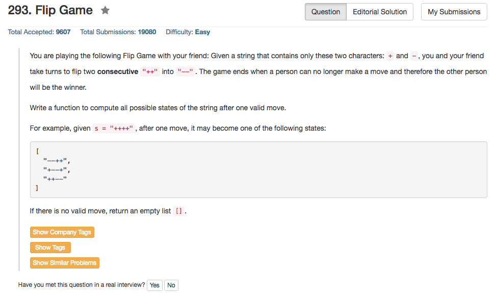

## Algorithm 

- 没什么好说的，直接扫一遍。
- 重要的还是C++里面的string和vector的操作

## Comment

- 注意这道题目只要把'+'变成'-'
- 主要还是string和vector上面的操作不是很熟悉

## Code

```C++
class Solution {
public:
    vector<string> generatePossibleNextMoves(string s) {
        vector<string> ans;
        int n = s.length() - 1;
        for (int i = 0; i < n; i++){
            printf("%d", i);
            if (s[i] == '+' && s[i + 1] == '+'){
                string tmp = s;
                tmp[i] = '-';
                tmp[i+1] = '-';
                ans.push_back(tmp);
            }
        }
        return ans;
    }
};
```