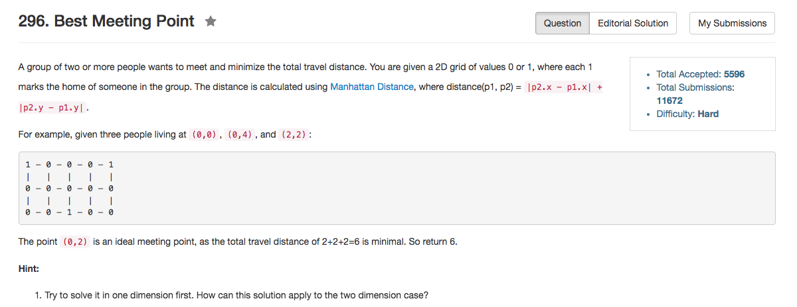

## Algorithm 

- 这个题目，根据提示，如果是1D的，那么这个问题其实就是找到`x_bar`使得`sum(|x[i] - x_bar|)`最小。这个问题就是，找到一个数使得数列中每一个值跟它的绝对值最小，这样的数——就是中位数。
- 由于row和col两个轴其实是独立的，所以本质上就是找到两个轴上所有坐标的中位数。
- 中位数比较好找：
    - 如果总数是奇数，那么看中间那个数是多少
    - 如果总数是偶数，那么看中间两个数的平均值是多少。
    - 可以把所有的数值都记录下来然后sort，这样找中位数就非常简单了
    - 也可以用类似桶排序的方法来记录。
- 整个算法的复杂度是O(mn)的，因为我们需要遍历一遍整个地图。算中位数其实是O(m+n)的。

## Comment

- 我毕竟还是写得不够优美。

## Code

类似桶排序的方法来找中位数

```C++
class Solution {
public:
    int minTotalDistance(vector<vector<int>>& grid) {
        if (grid.size() == 0) return 0;
        int n = grid.size();
        int m = grid[0].size();
        vector<int> row(n), col(m);
        int count = 0, dist = 0;
        for (int i = 0; i < n; i++)
            for (int j = 0; j < m; j++)
                if (grid[i][j] == 1) {
                    row[i]++;
                    col[j]++;
                    count++;
                }
        int dest_row = findMedian(row, n, count);
        int dest_col = findMedian(col, m, count);
        for (int i = 0; i < n; i++)
            for (int j = 0; j < m; j++)
                if (grid[i][j] == 1) {
                    dist = dist + abs(i - dest_row) + abs(j - dest_col);
                }
        return dist;
    }
private:
    int findMedian(vector<int>& data, int size, int count){
        int sum = 0, dest = 0;
        for (int i = 0; i < size; i++){
            sum += data[i];
            if (count % 2 == 1 && sum >= (count + 1) / 2) return i;
            if (count % 2 == 0){
                if (sum >= count / 2) dest = i;
                if (sum >= count / 2 + 1) return (dest + i) / 2;
            }
        }
        return -1;
    }
};

```

[这里](https://discuss.leetcode.com/topic/27748/12-13-lines-c)用的是`sort`和`nth_element`的方法，程序相对比较短。

```C++
int minTotalDistance(vector<vector<int>>& grid) {
    int total = 0, X = grid.size(), Y = grid[0].size();
    for (int dim=0; dim<2; ++dim) {
        int i = 0, k = 0, c[X*Y];
        for (int x=0; x<X; ++x)
            for (int y=0; y<Y; ++y)
                if (grid[x][y])
                    c[k++] = dim ? y : x;
        sort(c, c+k);
        while (i < --k)
            total += c[k] - c[i++];
    }
    return total;
}
```