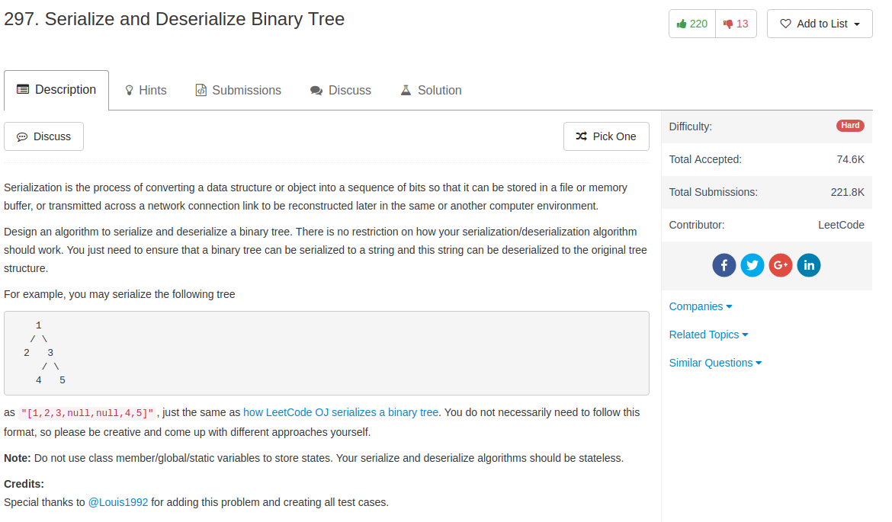

## Algorithm

- 直接BFS把树变成list
- 直接根据BFS的规则把list变成树

## Comment

- BFS写queue还是写的不够好啊

## Code

```python
# Definition for a binary tree node.
# class TreeNode(object):
#     def __init__(self, x):
#         self.val = x
#         self.left = None
#         self.right = None

class Codec:

    def serialize(self, root):
        """Encodes a tree to a single string.

        :type root: TreeNode
        :rtype: str
        """
        if root is None:
            return [None]
        queue = [root]
        ans = [root.val]
        while queue:
            r = queue[0]
            if r.left is None:
                ans.append(None)
            else:
                ans.append(r.left.val)
                queue.append(r.left)
            if r.right is None:
                ans.append(None)
            else:
                ans.append(r.right.val)
                queue.append(r.right)
            del queue[0]
        return ans

    def deserialize(self, data):
        """Decodes your encoded data to tree.

        :type data: str
        :rtype: TreeNode
        """
        if data[0] is None:
            return None
        root = TreeNode(data[0])
        queue = [root]
        point = 0
        while queue:
            r = queue[0]
            left_val = data[point + 1]
            right_val = data[point + 2]
            if left_val is not None:
                r.left = TreeNode(left_val)
                queue.append(r.left)
            if right_val is not None:
                r.right = TreeNode(right_val)
                queue.append(r.right)
            point = point + 2
            del queue[0]
        return root

# Your Codec object will be instantiated and called as such:
# codec = Codec()
# codec.deserialize(codec.serialize(root))
```
