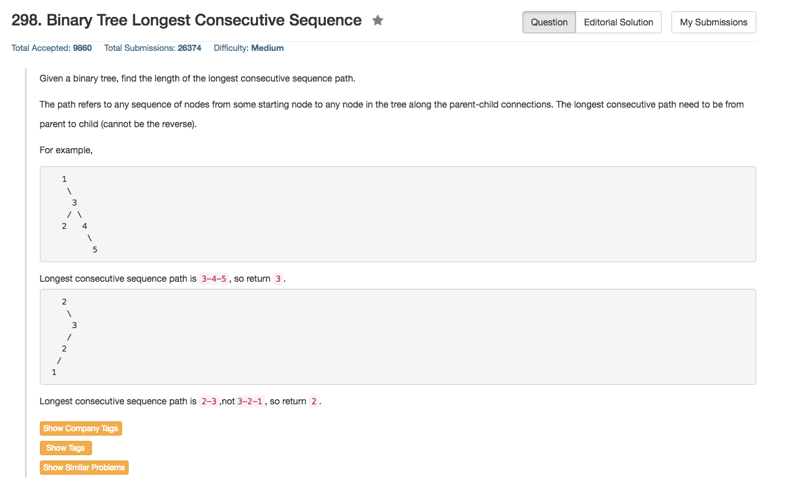

## Algorithm 

- 这个题目可以认为是简单的递推。
- 对于每一个结点，`Val[node]`计算以这个结点为根的最大长度。
    1. 如果这个结点是叶子结点，或者跟左右子树不连续，`Val[node] = 1`;
    2. 如果这个结点的值跟左子树的值连续递增，那么`Val[node] = max(Val[node], Val[node->left] + 1)`
    3. 右子树类似上面
    4. 记录所有结点中`Val[node]`的最大值，就是答案。

## Comment

- 并不是很复杂的算法，但是不同的写法会不一样。

## Code

```C++
class Solution {
public:
    int longestConsecutive(TreeNode* root) {
        int ans = 0;
        int rootVal = goTree(root, ans);
        return ans;
    }
private:
    int goTree(TreeNode* root, int& ans){
        if (root == NULL) return 0;
        int tmp = 1;
        if (root->left) {
            int leftMax = goTree(root->left, ans);
            if (root->val + 1 == root->left->val && leftMax + 1 > tmp) tmp = leftMax + 1; 
        }
        if (root->right){
            int rightMax = goTree(root->right, ans);
            if (root->val + 1 == root->right->val && rightMax + 1 > tmp) tmp = rightMax + 1;
        }
        ans = (tmp > ans) ? tmp : ans;
        printf("%d %d\n", root->val, tmp);
        return tmp;
    }
};
```
[这里](https://leetcode.com/discuss/66486/c-solution-in-4-lines)的程序更加简洁，只用了4行。非常棒。这里的思路是传递当前结点，父亲结点。本质上省去了我上面的判断左右子树是否为空的判断语句，也省略了左右子树非常相似的程序段。另外，这里的程序返回的是最大值，而当前`Val[node]`是作为参数传递的；而我返回的是`Val[node]`，而最大值是作为参数传递的。所以在主程序调用的时候他也要简洁一些。

```c++
class Solution {
public:
    int longestConsecutive(TreeNode* root) {
        return search(root, nullptr, 0);
    }

    int search(TreeNode *root, TreeNode *parent, int len) {
        if (!root) return len;
        len = (parent && root->val == parent->val + 1)?len+1:1;
        return max(len, max(search(root->left, root, len), search(root->right, root, len)));
    }
};
```
