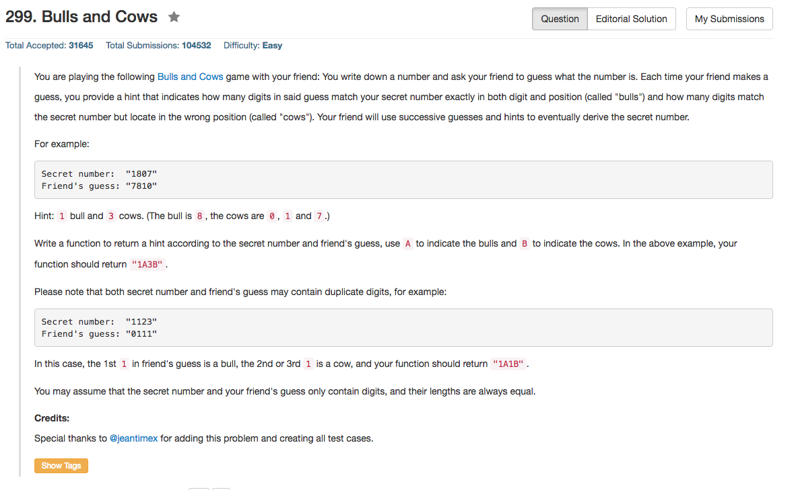

## Algorithm 

- 这个题目two pass的算法很简单
    - 基本的思路是bull也可以认为是cow的一部分，只要记得最后去除这个部分就好了
    - 先扫一遍secret，把每一个数字出现的次数统计一遍，保存在count中
    - 然后扫一遍guess，如果`count[guess[i] - '0']`不为0，那么说明存在一个cow的情况，也就是说数字猜对了一个，对应的count减1。注意这里我们不考虑位置是不是正确的，这也是前面所说的bull也是cow的一种的原因。
    - 如果`count[guess[i] - '0']==0`，那么就没有猜对的数字了。
- 但是one pass的算法就比较难想一些了，非常妙，[这里](https://leetcode.com/discuss/67031/one-pass-java-solution)解释了一下，基本的思路就是在记录count的时候，secret[i]贡献+1，guess[i]贡献-1。
    1. 如果`count[secret[i] - '0']`是负数，那么说明在之前guess数组中出现了当前的字符, `cow++`
    2. 类似的，如果`count[guess[i] - '0']`是正数，那么说明之前secret数组中出现了当前的字符, `cow++`
    3. 当然，以上两种条件要跟bull的条件分开，在这种one pass的算法中，bull和cow并不混做一谈。

## Comment

- 做题目还是要追求极致，比如这道题目的one pass的实现方法就应该好好学习一下
- 另外C++的字符串操作需要学习一下
    - String是可以用`+`来把字符和string连起来的；
    - `to_string()`可以把其他的类型转换为string

## Code

我的Two Pass的版本

```c++
class Solution {
public:
    string getHint(string secret, string guess) {
        int count[10] = {0}, bull = 0, cow = 0;
        for (int i = 0; i < secret.size(); i++){
          count[secret[i] - '0']++;  
        } 
        for (int i = 0; i < guess.size(); i++){
            if (guess[i] == secret[i]) {
                bull++;
            }
            if (count[guess[i] - '0']) {
                cow ++;
                count[guess[i] - '0'] --;
            }
        }
        return to_string(bull) + 'A'+ to_string(cow - bull) + 'B';
    }
};
```

我写的One Pass的版本

```c++
class Solution {
public:
    string getHint(string secret, string guess) {
        int count[10] = {0}, bull = 0, cow = 0;
        for (int i = 0; i < secret.size(); i++){
            if (guess[i] == secret[i]) {
                bull++;
            } else {
                if (count[secret[i] - '0'] < 0) cow++;
                if (count[guess[i] - '0'] > 0) cow++;
                count[secret[i] - '0']++;
                count[guess[i] - '0']--;
            }
        } 
        return to_string(bull) + 'A'+ to_string(cow) + 'B';
    }
};
```
