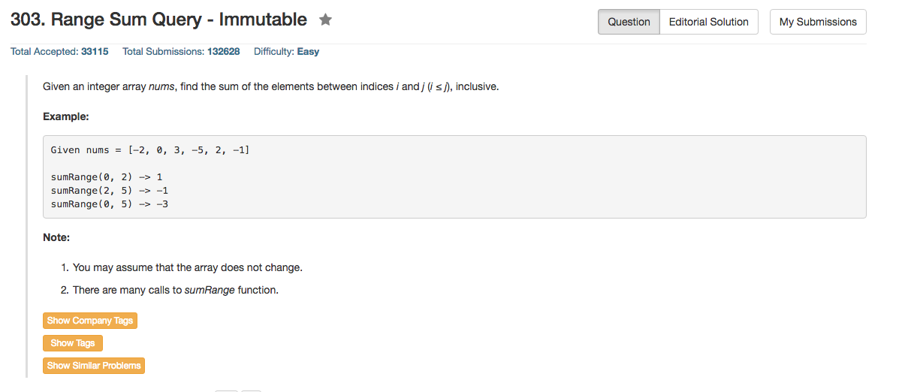

## Algorithm 

- 这个题目基本上没有什么技术含量吧，就是储存累积和(cumulative sum)就好了，然后每次访问都是O(1)的。

## Comment

- 然而还是要在OOP的框架下写这个程序，本质上是一个One Liner

## Code

```c++
class NumArray {
public:
    NumArray(vector<int> &nums) {
        for (int i = 0; i < nums.size(); i++){
            cumSum.push_back( (i == 0) ? nums[i] : nums[i] + cumSum[i - 1]);
        }
    }

    int sumRange(int i, int j) {
        return (i == 0) ? cumSum[j] : cumSum[j] - cumSum[i - 1];
    }
private:
    vector <int> cumSum;
};


// Your NumArray object will be instantiated and called as such:
// NumArray numArray(nums);
// numArray.sumRange(0, 1);
// numArray.sumRange(1, 2);
```
