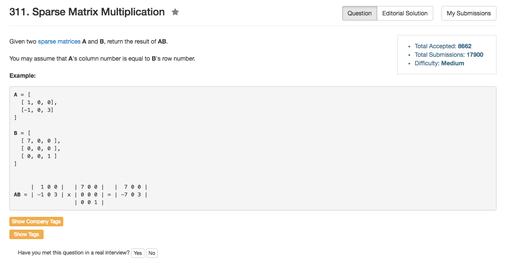

## Algorithm 

- 这个题目其实很直接，就是把所有非0的元素的位置存起来，然后遍历非0元素的位置进行计算。
- 基本的想法就是用一个链表（向量）把每一行哪些不是0的位置存起来。为了方便（其实是更麻烦），我存了A的行信息和B的列信息，结果在计算的时候就比较琐碎，错了几个细节。
- [这里](https://discuss.leetcode.com/topic/30625/easiest-java-solution)的解法非常干净，非常值得学习，附在了本文最后

## Comment

- 这个题目明显是我想复杂了。

## Code


```C++
class Solution {
public:
    vector<vector<int>> multiply(vector<vector<int>>& A, vector<vector<int>>& B) {
        int n1 = A.size(), m1 = A[0].size(), n2 = B.size(), m2 = B[0].size();
        vector<unordered_set<int>> rowA, colB;
        vector<vector<int>> result(n1, vector<int>(m2, 0));
        //Get row info in A
        for (int scanRow = 0; scanRow != n1; scanRow++){
            unordered_set<int> nonZero;
            for (int scanCol = 0; scanCol != m1; scanCol++){
                if (A[scanRow][scanCol]){
                    nonZero.insert(scanCol);
                }
            }
            rowA.push_back(nonZero);
            printf("A[%d] size = %d", scanRow, nonZero.size());
        }
        //Get col info in B
        for (int scanCol = 0; scanCol != m2; scanCol++){
            unordered_set<int> nonZero;
            for (int scanRow = 0; scanRow != n2; scanRow++){
                if (B[scanRow][scanCol]){
                    nonZero.insert(scanRow);
                }
            }
            colB.push_back(nonZero);
            printf("B[%d] size = %d", scanCol, nonZero.size());
        }
         printf("finish B\n");
        //Get Answer;
        for (int scanRow = 0; scanRow != n1; scanRow++){
            for (auto nonZero : rowA[scanRow]){
                for (int scanCol = 0; scanCol != m2; scanCol++){
                    if (colB[scanCol].count(nonZero)){
                        result[scanRow][scanCol] += A[scanRow][nonZero] * B[nonZero][scanCol];
                    }
                }
            }
        }
        //return Answer;
        return result;
    }
};
```

来自[这里]()的Java的解法，其实跟C++程序看起来差别不大。

```Java
public class Solution {
    public int[][] multiply(int[][] A, int[][] B) {
        int m = A.length, n = A[0].length, nB = B[0].length;
        int[][] C = new int[m][nB];

        for(int i = 0; i < m; i++) {
            for(int k = 0; k < n; k++) {
                if (A[i][k] != 0) {
                    for (int j = 0; j < nB; j++) {
                        if (B[k][j] != 0) C[i][j] += A[i][k] * B[k][j];
                    }
                }
            }
        }
        return C;   
    }
}

```
