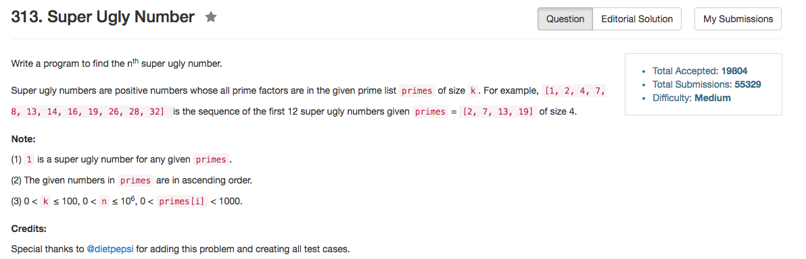

## Algorithm 

- 这个题目跟264是一个思路，唯一的不同是这里有k个质数，所以用一个循环来找最小值，时间复杂度O(nk)
- 当然，这个题目一定要算的话，可以用priority_queue/heap来每次找最小值，时间复杂度是O(nlogk)，但是如果用需先分配好的数组的话，O(nk)的算法不见得差。

## Comment

- 用O(nk)的算法，其实程序还是比较简单的。

## Code

```C++
class Solution {
public:
    int nthSuperUglyNumber(int n, vector<int>& primes) {
        vector<int> result(n, 1);
        vector<int> pos(primes.size(), 0);
        int k = primes.size(), count = 1;
        while (count < n){
            int minValue = INT_MAX, minIndex = 0;
            for (int i = 0; i < k; i++){
                if (result[pos[i]] * primes[i] < minValue){
                    minValue = result[pos[i]] * primes[i];
                    minIndex = i;
                }
            }
            if (minValue != result[count - 1]) {
                result[count++] = minValue;
            }
            pos[minIndex]++;
        }
        return result[n - 1];
    }
};
```
