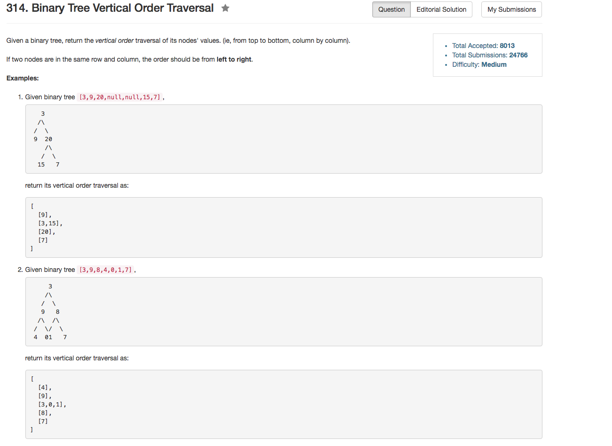

## Algorithm 

- 题目不难，就是一个BFS，主要的问题是不好确定每一个结点放置的位置。
- 我一开始想的方法是two pass，然后就可以找到整个树的宽度了，然后开一个数组直接更新对应位置就好。
- 结果第二个方法就是以root的位置为0，所有位置为正数的放一个数组，所有位置为负数的放到另外一个数组。
- 但是我的程序写的很丑
- [这里](https://discuss.leetcode.com/topic/31109/my-solution-in-c/2)用map写的，程序显得简洁很多，值得学习。这里其实使用了map的内在属性。

## Comment

- 这道题目不能使用DFS，只能使用BFS，因为涉及到从上往下看，层次和顺序还是比较重要的

## Code

```C++
/**
 * Definition for a binary tree node.
 * struct TreeNode {
 *     int val;
 *     TreeNode *left;
 *     TreeNode *right;
 *     TreeNode(int x) : val(x), left(NULL), right(NULL) {}
 * };
 */
class Solution {
public:
    vector<vector<int>> verticalOrder(TreeNode* root) {
        BFS(root);
        for (int i = neg.size() - 1; i >= 0; i--){
            result.push_back(neg[i]);
        }
        for (int i = 0; i != pos.size(); i++){
            result.push_back(pos[i]);
        }
        return result;
    }
private:
    vector<vector<int>> pos, neg, result;
    void BFS(TreeNode * root){
        queue<pair<TreeNode *, int>> searchQueue;
        if (root) searchQueue.push(pair<TreeNode* , int>{root, 0});
        while (!searchQueue.empty()){
            TreeNode* root = searchQueue.front().first;
            int loc = searchQueue.front().second;
            searchQueue.pop();
            if (loc >= 0) {
                if (loc + 1 > pos.size()){
                    pos.push_back(vector<int>(1, root->val));
                } else {
                    pos[loc].push_back(root->val);
                }
            } else {
                if (-loc > neg.size()){
                    neg.push_back(vector<int>(1, root->val));
                } else {
                    neg[-loc - 1].push_back(root->val);
                }
            }
            if (root->left) searchQueue.push(pair<TreeNode* , int>{root->left, loc - 1});
            if (root->right) searchQueue.push(pair<TreeNode* , int>{root->right, loc + 1});
        }
    }
};
```

程序代码来自StefanPochmann在[这里](https://discuss.leetcode.com/topic/31109/my-solution-in-c/2)的回答

```C++
vector<vector<int>> verticalOrder(TreeNode* root) {
    map<int, vector<int>> cols;
    queue<pair<TreeNode*, int>> q;
    if (root)
        q.emplace(root, 0);
    while (q.size()) {
        auto node = q.front().first;
        int x = q.front().second;
        q.pop();
        cols[x].push_back(node->val);
        if (node->left)
            q.emplace(node->left, x-1);
        if (node->right)
            q.emplace(node->right, x+1);
    }
    vector<vector<int>> result;
    for (auto col : cols)
        result.push_back(col.second);
    return result;
}
```
