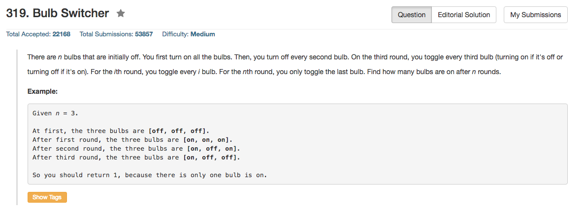

## Algorithm 

- 这个完全就是一个数学题目，这个规律其实很明显，我们来看一下如果有6个灯泡

<pre>
BULB:  1 2 3 4 5 6
1st:   + + + + + +
2nd:     +   +   +
3rd:       +     +
4th:         +
5th:           +
6th:             +
</pre>

- 好了，有什么规律？
	1. 如果一盏灯被switch过奇数次，这盏灯最终会是on；如果一盏灯被switch过偶数次，这盏灯最终会off
	2. 如果一个数字n有因数k, 那么第k次这盏灯会被switch一次。
	3. 一盏灯要被switch奇数次 == 数字n有奇数个因数
	4. 只有平方数才有奇数个因数，所以编号为`1^2, 2^2, ... x^2(x < n)`最终都会亮着
	5. 说到这里这个题目就解完了。

## Comment

- 这个题目都不值得用超过一种语言写，因为本质上所有语言都可以用桶一条语句。

## Code

```C
class Solution {
public:
    int bulbSwitch(int n) {
        return floor(sqrt(n));
    }
};
```

