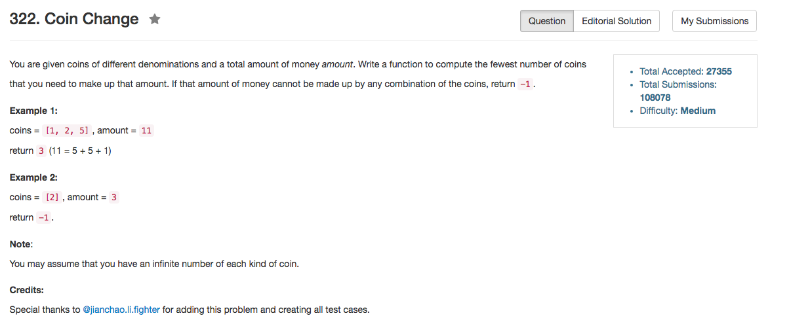

## Algorithm 

- 这个本质上就是一个0/1背包问题。而0/1背包问题是NP问题，所以本质上就是搜索解。
- 可以用BFS来搜索解，有些人也用DP来搜索解。理论上来说DP浪费了很多空间，没有必要。但是DP可以写的非常简洁，所以我也在这里摘录一下。
- BFS的话，就是从当前的状态，然后依次放入一个coin，更新状态。如果新的状态没有访问过，那就将来会要从这个状态出发搜索。因为是BFS，所以第一个找到的解肯定是步长最短的。

## Comment

- 老老实实写了BFS，随便我不确定我的BFS写的非常优美。

## Code

广搜的解

```C++
class Solution {
public:
    int coinChange(vector<int>& coins, int amount) {
        std::unordered_set<int> hash;
        queue<vector<int>> BFS;
        BFS.push({amount, 0});
        hash.insert(amount);
        while (BFS.size()){
            vector<int> state = BFS.front();
            if (state[0] == 0) return state[1];
            BFS.pop();
            for (int i = 0; i < coins.size(); i++){
                if (state[0] == coins[i]){
                    return state[1] + 1;
                } else if (state[0] > coins[i] && hash.count(state[0] - coins[i]) == 0){
                    hash.insert(state[0] - coins[i]);
                    BFS.push({state[0] - coins[i], state[1] + 1});
                }
            }
        }
        return -1;
    }
};

```

[这里](https://discuss.leetcode.com/topic/32602/c-dp-solution-o-n-m-time-o-m-space)用的是DP，整体来说程序写得更加清晰易懂。不过这个真的很耗空间啊。

```C++
class Solution
{
public:
    int coinChange(vector<int>& coins, int amount) 
    {
        vector<int> dp(amount + 1, -1);
        dp[0] = 0;
        
        for (int i = 1; i <= amount; ++i)
            for (auto & c : coins)
                if (i - c >= 0 && dp[i - c] != -1)
                    dp[i] = dp[i] > 0 ? min(dp[i], dp[i - c] + 1) : dp[i - c] + 1;
        
        return dp[amount];
    }
};
```