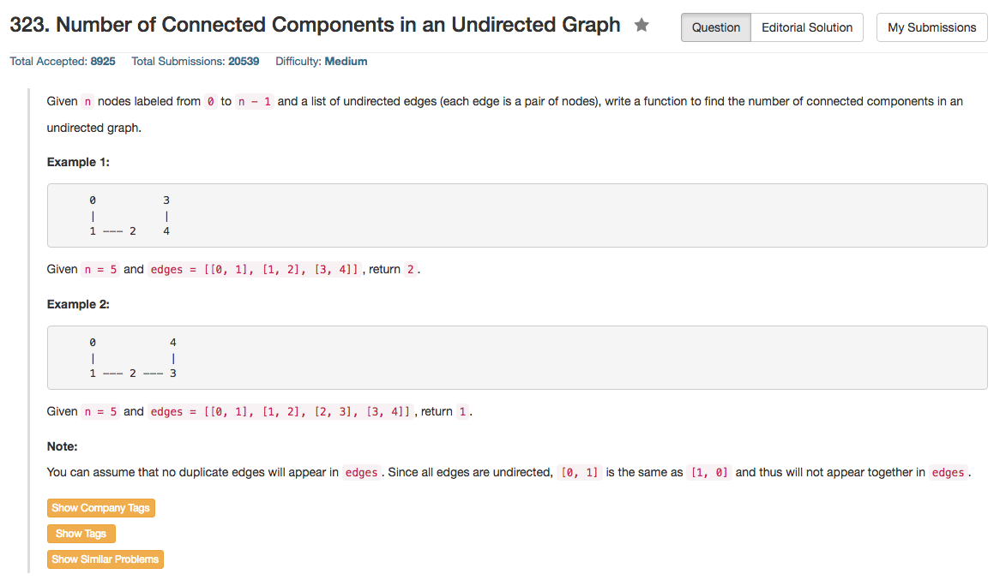

## Algorithm 

- 最容易想的，最直白的办法之一就是DFS。
    1. 找到一个没有遍历过的点，Connected Component总数加1
    2. 从这一个点出发，然后把这个点能够走到的所有点都遍历。
    3. 再看还是否剩下没有遍历的结点，如果有，回到1
- 但是上述DFS在现在的题目中有一个非常不方便的问题，就是图的表示方式是edge set，不可能DFS的时候从每一个结点都遍历一遍整个edge set找到它的邻接点。
- 为了解决上述问题，可以根据当前的edge set建立一个连接矩阵，这个邻接矩阵可以用Hash Table，也可以用Vector等等来实现。虽然我觉得这样都很慢，而且大量使用了额外的空间。
- 另外的方法就是union find的算法，这个算法其实我在Kruskal算法上面应该是学过的，但是时间久了，竟然都忘记了。[这里](https://leetcode.com/discuss/76594/short-union-find-in-python-ruby-c)有几个非常不错的版本。
    1. 另group[v]表示v所在的Component的代表性结点。
    2. 对于任意一条边[v, w]
        - 对于结点v，一直往上找，找到`group[v] == v`为止，才找到v所在的component的代表性结点v0。
        - 对于结点w，也用同样的方式找到其所在component的代表性结点w0。
        - 如果`v0!=w0`，那么让`group[v0]=w0`，这样两个结点就在同一个group里面了。整体不同的component数目减去1.
    3. 但是要注意的是，在追溯`group[v] == v`的过程中需要不断地更新group[v]的指向位置，最好就是一边追踪之后，整个序列上面所有的结点group[v']都指向了代表性结点v0。这个算法可以用深搜的回溯过程来完成。但是如果不用深搜，直接递推的话，可以先用`group[v] = group[group[v]]`来每次都让当前结点的group指向更早的位置。


## Comment

- 这道题目用C++写了好久的DFS，因为要通过edge set建立邻接矩阵，总觉得不是很开心。
- 而且这道题目出现一个`n == 0`的情况，我的所有`for`循环都傻逼了，直接报错。这仍然涉及到`for`循环的条件执行顺序——感觉`for`循环有点像do-while，所以当初始值就不满足终止条件的时候，循环内的语句好像还是执行了一遍。

## Code

Union Find的解法，以下这个程序来自于[这里](https://leetcode.com/discuss/76594/short-union-find-in-python-ruby-c)

```c++
int countComponents(int n, vector<pair<int, int>>& edges) {
    vector<int> p(n);
    iota(begin(p), end(p), 0); //这个有点厉害，这个本质上就是从头到尾，从0开始依次增加
    for (auto& edge : edges) {
        int v = edge.first, w = edge.second;
        while (p[v] != v) v = p[v] = p[p[v]];
        while (p[w] != w) w = p[w] = p[p[w]];
        p[v] = w;
        n -= v != w;
    }
    return n;
}
```

Union Find的解法，我写的版本，相比之下就写得非常丑陋了。

```c++
class Solution {
public:
    int countComponents(int n, vector<pair<int, int>>& edges) {
        if (n == 0) return 0;
        int group[n], count = n;
        for (int i = 0; i < n; i++){
            group[i] = i;
        }
        for (auto& edge : edges){
            int v = edge.first, w = edge.second;
            while (group[v] != v) {
                group[v] = group[group[v]];
                v = group[v];
            }
            while (group[w] != w) {
                group[w] = group[group[w]];
                w = group[w];
            }
            count = count - (v != w);
            group[v] = w;
        }
        return count;
    }

};
```

DFS的解法

```c++
class Solution {
public:
    int countComponents(int n, vector<pair<int, int>>& edges) {
        if (n == 0) return 0;
        for (int i = 0; i < n; i++){
            adjLink.push_back(vector<int>(0));
        }
        for (auto iter : edges){
            adjLink[iter.first].push_back(iter.second);
            adjLink[iter.second].push_back(iter.first);
        }
        bool visited[n] = {false};
        int count = 0;
        for (int i = 0; i < n; i++){
            if (visited[i] == false){
                count++;
                goVisit(i, visited);
            }
        }
        return count;
    }
    void goVisit(int i, bool visited[]){
        visited[i] = true;
        for (int iter : adjLink[i]){
            if (visited[iter] == false) {
                goVisit(iter, visited);
            }
        }
    }
private:
    vector<vector<int>> adjLink;
};
```