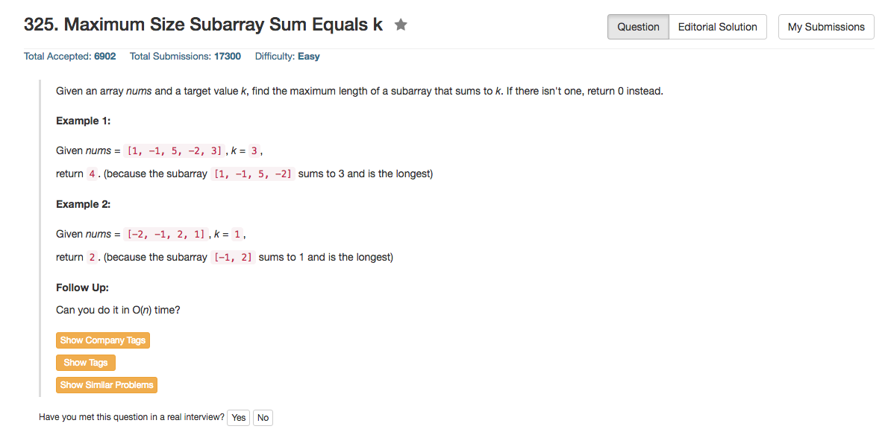

## Algorithm 

- 如果使用cumulative sum，这个题目其实很简单，就是问所有满足`cumSum[i] - cumSum[j] == k`的<i,j>对中(i - j)最大的是多少；另外我们定义cumSum[-1] = 0来处理边界条件。
- 上面这个的算法的最朴实的实现方法就是O(n^2)的，直接循环
- 当然，其实可以考虑给定cumSum[i]，目的就是找到之前所有cumSum[-1]...cumSum[i-1]中是否存在一个`cumSum[j]`满足`cumSum[i] - cumSum[j] == k`，简单的想法就是储存之前所有的cumSum[j]及其位置j。
    - 注意：如果`cumSum[j] == cumSum[k]`，那么储存位置比较靠前的那个
    - 储存的方法可以用Binary Search Tree - 每次查询和添加 O(logN)
    - 储存的方法也可以用Hash Map - 每次查询和添加 O(1) 
    

## Comment

- Hash Map的实现和程序语言相关，到底是不是O(1)的这个问题要调查。
- C++的实现方法：`std:unordered_map<int, int> hashMap`。
- Python的实现方法：`待查`


## Code

比较精简的C++的版本：

```c++
class Solution {
public:
    int maxSubArrayLen(vector<int>& nums, int k) {
        std::unordered_map<int, int> hashMap;
        hashMap[0] = -1;
        int maxLength = 0, cumSum = 0;
        for (int i = 0; i < nums.size(); i++){
            cumSum += nums[i];
            if (hashMap.find(cumSum - k) != hashMap.end()){
                maxLength = max(maxLength, i - hashMap[cumSum - k]);
            }
            if (hashMap.find(cumSum) == hashMap.end()){
                hashMap[cumSum] = i;
            }
        }
        return maxLength;
    }
};
```

我第一次写的C++的版本：

```c++
class Solution {
public:
    int maxSubArrayLen(vector<int>& nums, int k) {
        int * result = (int*) malloc(nums.size() * sizeof(int));
        std::unordered_map<int, int> hashMap;
        hashMap[0] = -1;
        int maxLength = 0, cumSum = 0;
        for (int i = 0; i < nums.size(); i++)
            subSum[i] = (i == 0) ? nums[i] : nums[i] + subSum[i - 1];
        for (int i = 0; i < nums.size(); i++){
            result[i] = (i == 0) ? 0 : result[i - 1];
            if (hashMap.find(subSum[i] - k) != hashMap.end()){
                result[i] = max(result[i], i - hashMap[subSum[i] - k]);
            }
            if (hashMap.find(subSum[i]) == hashMap.end()){
                hashMap[subSum[i]] = i;
            }
            maxLength = max(maxLength, result[i]);
        }
        return maxLength;
    }
};
```