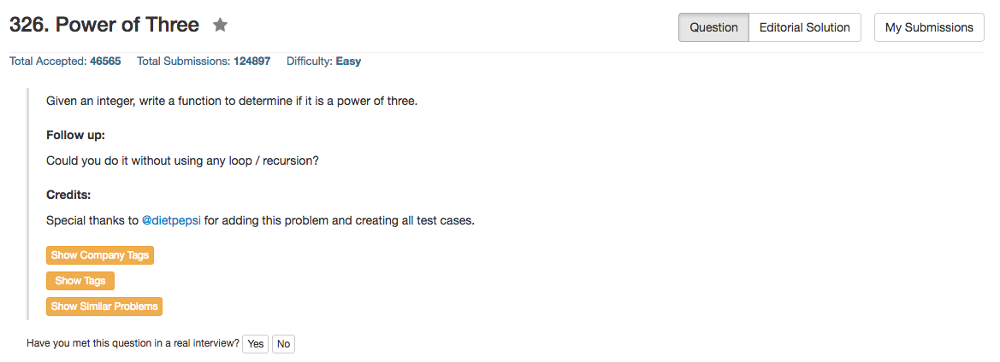

## Algorithm 

- 这个题目跟231非常相似，但是因为不是2的幂，所以`n & (n-1)`这个技巧用不了。
- 当然了，最容易想的就是写一个循环每一位判断一下，这个依旧就比较慢了。
- 另外一个方法就是找到一个更大的整数，比如3^20：只有n是3的幂的时候，`3^30 % n == 0`才成立。当然，实际上并不一定要找到3^20这么大，只要找到int范围内最大的3的幂就好了，这个数是**1162261467**。
- 当然，另外一个方法就是算`log10(n)/log(3)`是不是整数，这里会涉及到浮点误差的问题，要注意判断边界。

## Comment

- 熟悉位操作咯
- 要注意的是输入可以是非正数，但是题目看来是假设只有正数是3的幂，不过这的确也符合定义。我觉得在面试的时候如果不确定的话也还是可以跟面试官讨论一下吧——虽然结果会显得很傻。
- [这里这个帖子]()实在是讨论的太全了，把所有的方法都整理了一遍。
- 因为所有的语言都基本上可以用同一条语句，这里就不写其他语言的版本了。

## Code

```c
bool isPowerOfThree(int n) {
    return (n > 0 && 10460353203L % n == 0);
}
```
<hr>

