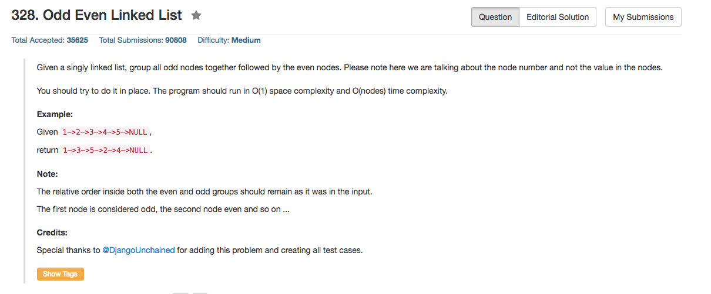

## Algorithm 

- 这个题目倒是没有什么特别的，就是用两个指针就好了。一个odd，一个even，分别成链，然后最后把这两个链合并起来。

## Comment

- 这道题目倒是比较基础的two pointer linked list的题目。

## Code

```C
class Solution {
public:
    ListNode* oddEvenList(ListNode* head) {
        if (head == NULL) return head;
        ListNode* odd = head, *even = head->next, *evenHead = head->next;
        while (even){
            odd->next = even->next;
            if (odd->next) {
                odd = odd->next;
            }
            even->next = odd->next;
            even = even->next;
        }
        odd->next = evenHead;
        return head;
    }
};
```
[这里](https://leetcode.com/discuss/81397/simple-c-solution-o-n-time-o-1-space)的程序更加简洁，没有`while`循环里面的判断语句，主要是把条件写在了`while`里面

```c++
ListNode* oddEvenList(ListNode* head) 
{
    if(!head) return head;
    ListNode *odd=head, *evenhead=head->next, *even = evenhead;
    while(even && even->next)
    {
        odd->next = odd->next->next;
        even->next = even->next->next;
        odd = odd->next;
        even = even->next;
    }
    odd->next = evenhead;
    return head;
}
```
