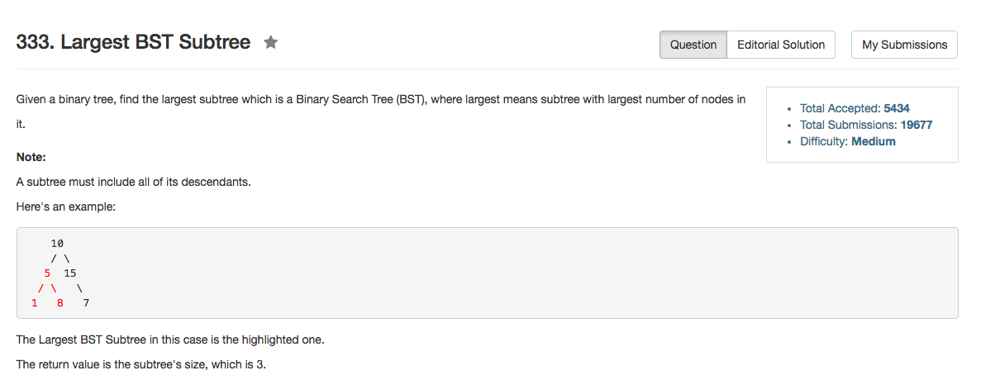

## Algorithm 

- 直接二叉树遍历后序一遍就好了，需要记录的是
    1. 左子树是不是BST
    2. 右子树是不是BST
    3. 左子树的最大值是不是小于根
    4. 右子树的最小值是不是大于根
    5. 如果以上都满足，那以当前根就是一个BST，更新最大BST的大小。

## Comment

- 二叉树一般都用递归比较好解决

## Code

```C++
class Solution {
public:
    int largestBSTSubtree(TreeNode* root) {
        bool isBST = true;
        int minValue, maxValue;
        int rootCount = travel(root, isBST, minValue, maxValue);
        return result;
    }
private:
    int result;
    int travel(TreeNode* root, bool& isBST, int& minValue, int& maxValue){
        if (!root) return 0;
        bool isLeft = true, isRight = true;
        int leftMin = root->val, leftMax = root->val, rightMin = root->val, rightMax = root->val;
        int leftCount = 0, rightCount = 0;
        if (root->left) leftCount = travel(root->left, isLeft, leftMin, leftMax);
        if (root->right) rightCount = travel(root->right, isRight, rightMin, rightMax);
        if (isLeft && isRight && leftMax <= root->val && rightMin >= root->val){
             minValue = leftMin;
             maxValue = rightMax;
             isBST = true;
             result = max(result, leftCount + rightCount + 1);
             return leftCount + rightCount + 1;
        } else {
            isBST = false;
            return 0;
        }
    }
};
```
