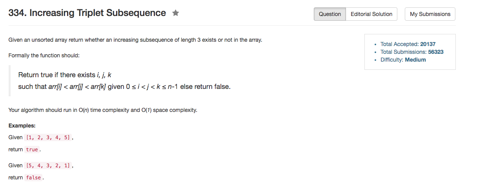

## Algorithm 

- 这道题目也没什么好说的，就是用两个变量记录`min1`, `min2`，也就是当前最小的和次小的。
- 首先判断`nums[i] > min2`，如果比当前的次小的还大，那么肯定存在一个合法序列
- 然后判断`nums[i] > min1`，如果比当前最小的要小，那么更新次小的。尤其是要注意，因为最小的元素可能比上一个次小的元素位置上靠后，所以这里就要直接更新次小的。
- 最后判断`nums[i] <= min1`，如果找到了更小的最小值，直接更新最小值。

## Comment

- 判断语句的顺序很重要

## Code

```C++
class Solution {
public:
    bool increasingTriplet(vector<int>& nums) {
        int min1 = INT_MAX, min2 = INT_MAX, n = nums.size();
        for (int i = 0; i != n; i++){
            if (nums[i] > min2) {
                return true;
            } else if (nums[i] > min1){
                min2 = nums[i];
            } else {
                min1 = nums[i];
            }
        }
        return false;
    }
};
```
