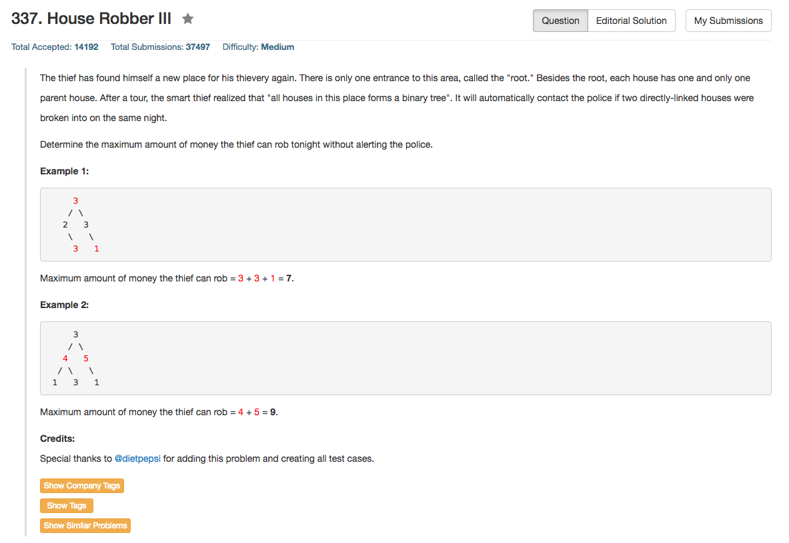

## Algorithm 

- 如果用类似之前House Robber的方法，基本的思路很直接，就是看当前root这个值选不选，对于每一个root都记录两个状态的最大值：选择root的状态下可以得到的最大值`rootTaken[root]`，不选择root的状态下可以得到的最大值`rootNotTaken[root]`
    1. 如果`root`选的话，那就是左子树和右子树的root不能选，也就是说`rootTaken[root] = rootNotTaken[root->left] + rootNotTaken[root-right]`
    2. 如果`root`不选的话，那么左右子树的root就随便选不选了，也就是说`rootNotTaken[root] = max(rootTaken[root->left], rootNotTaken[root->left]) + max(rootTaken[root-right], rootNotTaken[root->right])`
- 边界条件很简单，如果root为空，那么返回0；
- 但是这里涉及到在树上的动态规划的实现问题

## Comment

- 在树上的动态规划需要注意状态的储存和遍历的问题，要尽量控制同一个状态搜索两遍
- 以上问题的解决方法基本上就是2种
    1. 用hash表之类的数据结构记录下遍历过的状态的值
    2. 改写程序，控制搜索的顺序不反复多次访问同一个状态
- 关于C++中使用`pair<int int>`这样的手法来让函数返回多个值的细节，也是值得学习和了解的。

## Code

程序只对所有的状态访问一遍，及时记录最后的状态，防止一个状态搜索多次。

```c++
/**
 * Definition for a binary tree node.
 * struct TreeNode {
 *     int val;
 *     TreeNode *left;
 *     TreeNode *right;
 *     TreeNode(int x) : val(x), left(NULL), right(NULL) {}
 * };
 */
class Solution {
public:
    void robTravel(TreeNode* root, int & rootTaken, int & rootNotTaken){
        if (!root) {
            rootTaken = 0;
            rootNotTaken = 0;
        } else {
            int leftTaken, leftNotTaken, rightTaken, rightNotTaken;
            robTravel(root->left, leftTaken, leftNotTaken);
            robTravel(root->right, rightTaken, rightNotTaken);
            rootTaken = leftNotTaken + rightNotTaken + root->val;
            rootNotTaken = max(leftTaken , leftNotTaken) + max(rightTaken, rightNotTaken);
        }
    }
    int rob(TreeNode* root) {
        int rootTaken = 0, rootNotTaken = 0;
        robTravel(root, rootTaken, rootNotTaken);
        return max(rootTaken, rootNotTaken); 
    }
};
```

[这里](https://leetcode.com/discuss/91899/step-by-step-tackling-of-the-problem)讨论了不好的实现是如何导致重复搜索已经搜索过的状态的。

```c++
public int rob(TreeNode root) {
    if (root == null) {
        return 0;
    }

    int val = 0;

    if (root.left != null) {
        val += rob(root.left.left) + rob(root.left.right);
    }

    if (root.right != null) {
        val += rob(root.right.left) + rob(root.right.right);
    }

    return Math.max(val + root.val, rob(root.left) + rob(root.right));
}
```

以上的这个版本，我们可以看到rob(root.left.left)这个状态实际上是访问了很多次，一次在中间的if语句中访问了，还有一次在最后一行rob(root.left)的调用的时候又访问了。结果造成了很大的时间上的浪费，而下面的程序就用Hash表来记录了访问过的状态，当同一个状态再次被访问的时候，就只要从Hash表里面读出结果就好了。这样大大降低了时间。

```
public int rob(TreeNode root) {
    Map<TreeNode, Integer> map = new HashMap<>();
    return robSub(root, map);
}

private int robSub(TreeNode root, Map<TreeNode, Integer> map) {
    if (root == null) return 0;
    if (map.containsKey(root)) return map.get(root);

    int val = 0;

    if (root.left != null) {
        val += robSub(root.left.left, map) + robSub(root.left.right, map);
    }

    if (root.right != null) {
        val += robSub(root.right.left, map) + robSub(root.right.right, map);
    }

    val = Math.max(val + root.val, robSub(root.left, map) + robSub(root.right, map));
    map.put(root, val);

    return val;
}
```

另外，[这里](https://leetcode.com/discuss/91652/c-java-python-%26-explanation)的程序使用了`pair<int int>`的结构来让函数返回过的值，也是另外一种实现方式。

```c++
class Solution {
public:
    int rob(TreeNode* root) {
        return robDFS(root).second;
    }
    pair<int, int> robDFS(TreeNode* node){
        if( !node) return make_pair(0,0);
        auto l = robDFS(node->left);
        auto r = robDFS(node->right);
        int f2 = l.second + r.second;
        int f1 = max(f2, l.first + r.first + node->val);
        return make_pair(f2, f1);
    }
};
```