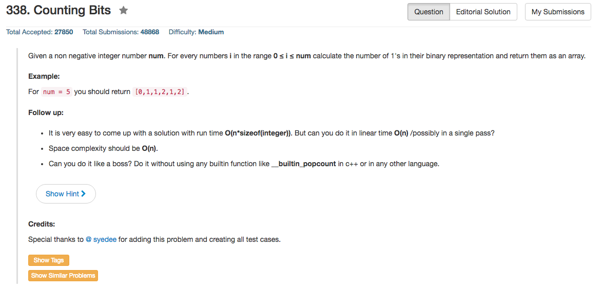

## Algorithm 

- 就是简单地位操作，其实本质上是找规律，这个题目只要one pass的O(n)就好了。

<pre>
NUM:			0		  1
BINARY: 	0		  1
BIT:  		0		  1

NUM:  		2  		3
BINARY:   10		11
BIT:  		1			2

NUM:			4			5			6			7
BINARY:		100		101		110		111
BIT:			1			2			2			3  
</pre>

- 这里可以看到，某一个2的幂开始，实际上就是把之前从0-2^(n-1)的所有结果加上1个1就好了。
- 比如8 - 15的1的个数就是0 - 7的对应个数加上1，得到[1,2,2,3,2,3,3,4]

## Comment

- 没有什么特别多要注意的，有很多有趣的bit operation

## Code

```c++
class Solution {
public:
    vector<int> countBits(int num) {
        vector<int> ans;
        ans.push_back(0);
        for (int i = 1, pointer = 0; i <= num; i++, pointer++){
            if ((i & (i - 1)) == 0) pointer = 0;
            ans.push_back(ans[pointer] + 1);
        }
        return ans;
    }
};
```