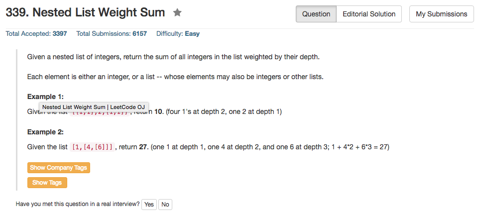

## Algorithm 

- 这道题目算法方面倒也没什么难的，但是在语言实现方面倒是不容易。
- 算法就是直接用递归就好了，而且题目都已经帮你定义好的操作的定义，只是原始函数里面没有带入深度这个参数，不方面直接写。可以把深度作为一个全局变量，但是更加保险的方法是写一个新的函数把深度作为参数带进去。
- 这道题目对我来说最复杂的还是OOP的实现，包括如何使用类型定义的函数。这些实现方式对我来说都不是非常直观。
- 可惜讨论里面没有把C++代码写得非常优美的，基本上跟我写的差不多。

## Comment

- 需要认真熟悉一下OOP，虽然OOP不见得是一种好的编程范式。

## Code

```c++
/**
 * // This is the interface that allows for creating nested lists.
 * // You should not implement it, or speculate about its implementation
 * class NestedInteger {
 *   public:
 *     // Return true if this NestedInteger holds a single integer, rather than a nested list.
 *     bool isInteger() const;
 *
 *     // Return the single integer that this NestedInteger holds, if it holds a single integer
 *     // The result is undefined if this NestedInteger holds a nested list
 *     int getInteger() const;
 *
 *     // Return the nested list that this NestedInteger holds, if it holds a nested list
 *     // The result is undefined if this NestedInteger holds a single integer
 *     const vector<NestedInteger> &getList() const;
 * };
 */
class Solution {
public:
    int depthGo(vector<NestedInteger>& nestedList, int depth){
        int sum = 0;
        for (int i = 0; i < nestedList.size(); i++){
            if (nestedList[i].isInteger()) {
                sum = sum + nestedList[i].getInteger() * depth;
            } else {
                sum = sum + depthGo(nestedList[i].getList(), depth + 1);
            }
        }
        return sum;
    }
    int depthSum(vector<NestedInteger>& nestedList) {
        return depthGo(nestedList, 1);
    }
};
```