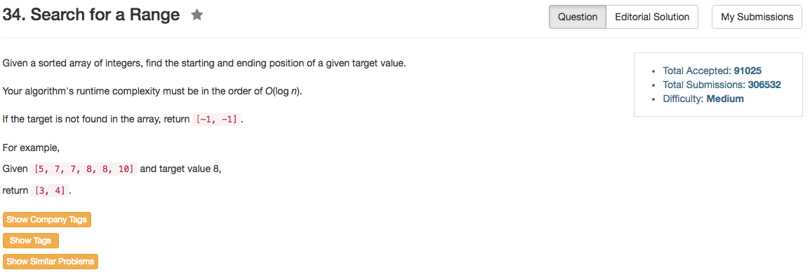

## Algorithm 

- 当然这就是个二分搜索，但是问题就在于如何找到二分搜索的范围
- 我觉得这道题目很好地测试了二分搜索的思路，关键就在于什么时候移动`left`和`right`指针。
    1. 如果是`if (nums[mid] >= target)`的条件来将`right = mid - 1`, 由于这里容忍`==`的情况，所以最终得到的结果是一串连续相同的target的左边界
    2. 如果是`if (nums[mid] > target)`的条件来将`right = mid - 1`, 由于这里不容忍`==`的情况，所以最终得到的结果是一串连续相同的target的右边界。
    3. 我在这里通过带入参数`0/1`来控制上面的判断条件，所以一个程序就能搞定两种情况。

## Comment

- 这道题目堪称二分搜索的经典边界条件测试。 
- 二分搜索真的是充满了各种可能性！

## Code

```c++
class Solution {
public:
    vector<int> searchRange(vector<int>& nums, int target) {
        vector<int> ans;
        ans.push_back(search(nums, target, 0));
        ans.push_back(search(nums, target, 1));
        return ans;
    }
private: 
    int search(vector<int>& nums, int target, int addition){
        int left = 0, right = nums.size() - 1, ans = -1;
        while (left <= right){
            int mid = left + (right - left) / 2;
            if (nums[mid] == target) {
                ans = mid;
            }
            if (nums[mid] >= target + addition) {
                right = mid - 1;
            } else {
                left = mid + 1;
            }
        }
        return ans;
    }
};
```
