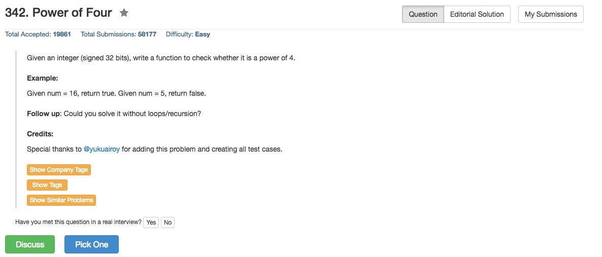

## Algorithm 

- 这个题目跟231，326非常相似，但是因为是4的倍数就一定是2的倍数，所以之前的一些技巧都不能用。
- 当然了，最容易想的就是写一个循环每一位判断一下，这个依旧就比较慢了。
- 还剩下的方法就是算`log10(n)/log(4)`是不是整数，这里会涉及到浮点误差的问题，要注意判断边界。
- 当然，还有新的方法：
	- n如果是4的幂，那么(n-1)要是3的倍数，因为4^n - 1 = (4-1) * (4^(n-1) + 4^(n-2) + ... + 1)，这就可以吧4的幂和2的幂区分开来。
	- 另外就是用Mask，因为4的幂只能是在奇数位上有1，偶数位上必须是0，所以可以用0x55555555这个Mask来看是不是4的幂：`0x55555555 = 0b1010101010101010101010101010101`

## Comment

- 熟悉位操作咯
- 要注意的是输入可以是非正数，这个问题的讨论见326和231。
- 因为所有的语言都基本上可以用同一条语句，这里就不写其他语言的版本了。

## Code

```c
bool isPowerOfFour(int num) {
   return (num > 0 && log(num)/log(4.0) - (int)(log(num)/log(4.0)) < 1e-10); 
}
```

[这里的讨论](https://leetcode.com/discuss/98011/1-line-c-solution-without-confusing-bit-manipulations)提供了如下的代码

```c
bool isPowerOfFour(int num) {
    return num > 0 && (num & (num - 1)) == 0 && (num - 1) % 3 == 0;
}
```

[这里的讨论](https://leetcode.com/discuss/97924/o-1-one-line-solution-without-loops)提供了Mask的解法

```java
	return (num > 0) && ((num & (num - 1)) == 0) && ((num & 0x55555555) == num);
```


