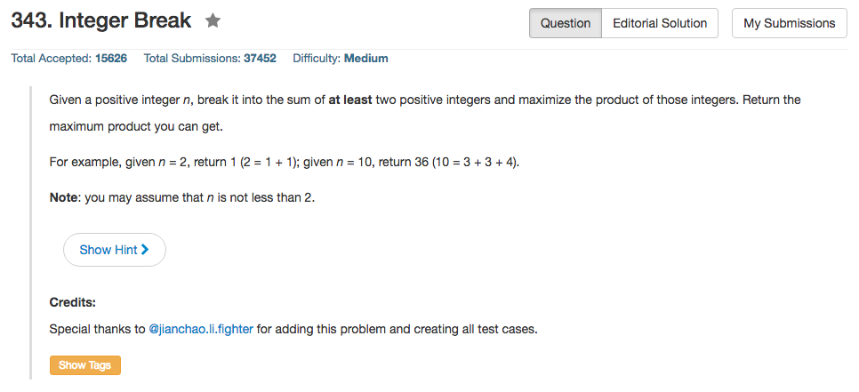

## Algorithm 

- 这道题目其实蛮容易的，就是分解成尽量多的3，然后分解成1到2个2.
- 如果`n<4`，那没办法，分解成`1 + (n - 1)`肯定是最大的。
- 否则的话:
	1. 如果`n % 3 == 0`，那就分解成3的和，因为`6 = 2 + 2 + 2 = 3 + 3`，但是`2^3 < 3 ^ 2`，所以尽量分解成3会要好一些
	2. 如果`n % 3 == 1`, `n = (n - 4) + 4`，其中`n - 4`参考1.
	3. 如果`n % 3 == 2`, `n = (n - 2) + 2`，其中`n - 2`参考1.
- 我不确定我为什么知道答案，但是我记得我就是知道答案，如果想知道为什么的话，[这里](https://leetcode.com/discuss/98276/why-factor-2-or-3-the-math-behind-this-problem)有一些解释

## Comment

- 我觉得算不上Medium的题目

## Code

```c++
class Solution {
public:
    int integerBreak(int n) {
        int tmp = 1;
        long long ans = 1;
        if (n <= 3) return (n - 1);
        if (n % 3 == 1) {
            n = n - 4;
            tmp = 4;
        } else if (n % 3 == 2){
            n = n - 2;
            tmp = 2;
        }
        while (n > 0){
            ans = ans * 3;
            n = n - 3;
        }
        return ans * tmp;
    }
};
```