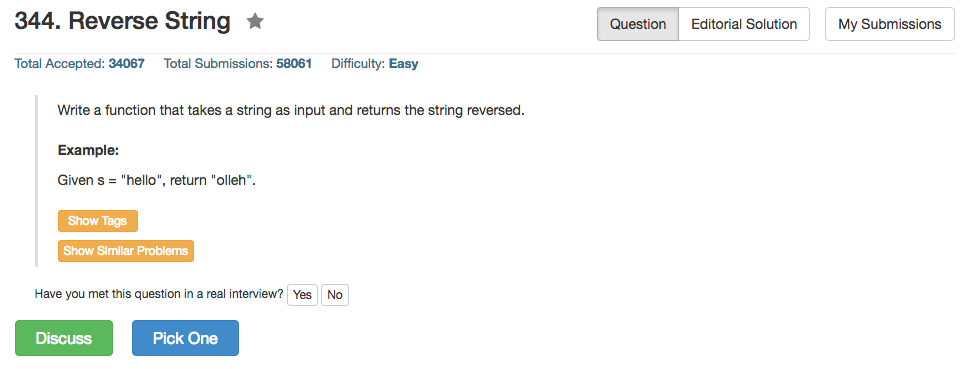

## Algorithm 

- 这个基本上就是考对语言的熟悉

## Comment

- Python需要注意一下subsetting的特殊语法：`s[::-1]`，这也就是1行的事情。
- C的话，没有字符串的直接操作；C++的话，对于String还有s.size()这个函数直接调用长度，不过思路是差不多的。

## Code

```C
char* reverseString(char* s) {
    int len,i,j;
    for (len = 0; s[len] != '\0'; len++)
        ;
    for (i = 0, j = len - 1; i < j; i++, j-- ){
        char c = s[i];
        s[i] = s[j];
        s[j] = c;
    }
    return s;
}```

<hr>

```python
class Solution(object):
    def reverseString(self, s):
        """
        :type s: str
        :rtype: str
        """
        return s[::-1]
```
<hr>
