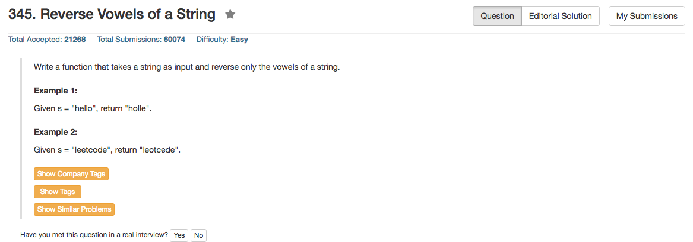

## Algorithm 

- 很简单的题目：两个pointer，一个从前往后扫，一个从后往前扫，如果两个pointer同时指向元音字母，就把对应的字母调换一下就好了。

## Comment

- 注意循环和字母调换的边界条件，我一开始没有注意这个细节导致字母调换了两边
- 另外判断一个字母是不是元音字母有很多方法
    - 可以用std:set
    - 也可以用一个bool vowels[256]
    - 也可以直接写非常长的判断语句——但是这样会违背**Don't Repeat Yourself**的原则
    
## Code

不安全的版本

```c++
class Solution {
public:
    string reverseVowels(string s) {
        int forward = 0, backward = s.size() - 1;
        std:set<int> vowels = {'a','e','i','o','u','A','E','I','O','U'};
        while (forward < backward){
            while (vowels.count(s[forward]) == 0) forward++;
            while (vowels.count(s[backward]) == 0) backward--;
            if (forward < backward) {
                swap(s[forward], s[backward]);
                forward++;
                backward--;
            }
        }
        return s;
    }
};
```

[这里](https://leetcode.com/discuss/99073/1-2-lines-python-ruby)有ruby和python的一行版本，实在是很厉害