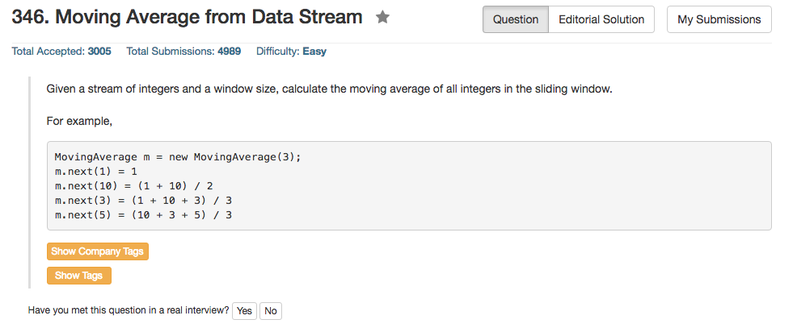

## Algorithm 

- 这个本质上就是一个Queue的数据结构，比如[这里](https://leetcode.com/discuss/106084/c-easy-understand-solution)和[这里](https://leetcode.com/discuss/100352/c-easy-solution-using-queue)的解法。
- 当然，为了节省内存，可以用一个循环队列；当然并不知道C++里面队列pop-out之后会不会自动缩小内存容量。

## Comment

- 并不知道C++里面Queue和Vector的实现方式是怎么样的，这些内容需要认真学习一下。
- 另外，C++里面OOP的初始化定义方式需要在学习，比如下面第一个版本中的那种初始化定义，也是蛮醉的，我不是很熟悉这种方法。

## Code

```c++
class MovingAverage {
    std::vector<int> array; //很显然函数定义应该放在这里
    int currentPos;
    int arraySize;
public:

    MovingAverage(int size):array(size),arraySize(size),currentPos(0){};
    
    double next(int val) {
        array[currentPos % arraySize] = val;
        currentPos = currentPos + 1;
        double avg = 0;
        for (int i = 0; i<arraySize; i++) avg = avg + array[i];
        return avg / min(arraySize, currentPos);
    }
};
```
另外一种初始化的形式：

```c++
class MovingAverage {
public:
    std::vector<int> array;
    int currentPos;
    int arraySize;
    MovingAverage(int size){ //我并不确定这种初始化是对的
        this.array = vector<int>(size); //尤其不确定这个vector的初始化是对的
        this.currentPos = 0;
        this.arraySize = size;
    };
    
};
```