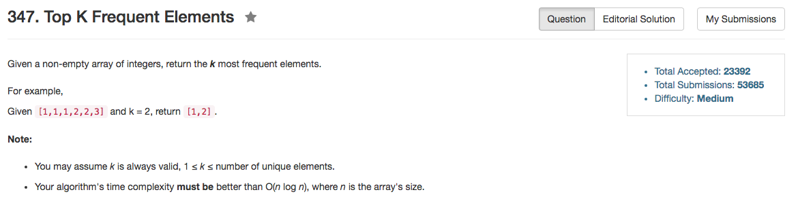

## Algorithm 

- 桶排序的好例子
- 可以比较好地构造一串标号[0, n]的桶，然后统计`nums`中每一个元素出现了多少次，如果一个元素出现了`k`次，就把这个元素放到标号为`k`的桶里面。然后再从`n`到`1`逆着扫一遍，如果某一个桶里面有元素，那么这就是出现次数很高的元素，把它放入结果数组中。如此直到结果数组中放了k个元素为止。

## Comment

- 一开始的确是没有想到桶排序，这个算法很早就知道，但是到底是很久没有研究算法了。

## Code

```c++
class Solution {
public:
    vector<int> topKFrequent(vector<int>& nums, int k) {
        int n = nums.size() + 1;
        vector<vector<int>> busket(n, vector<int>());
        vector<int> results;
        unordered_map<int, int> record;
        for (auto num:nums){
            record[num]++;
        }
        for (auto num : record){
            int count = num.second;
            busket[count].push_back(num.first);
        }
        for (int scan = n - 1; scan > 0; scan--){
            while (k > 0 && busket[scan].size()){
                results.push_back(busket[scan].back());
                busket[scan].pop_back();
                k--;
            }
        }
        return results;
    }
};
```