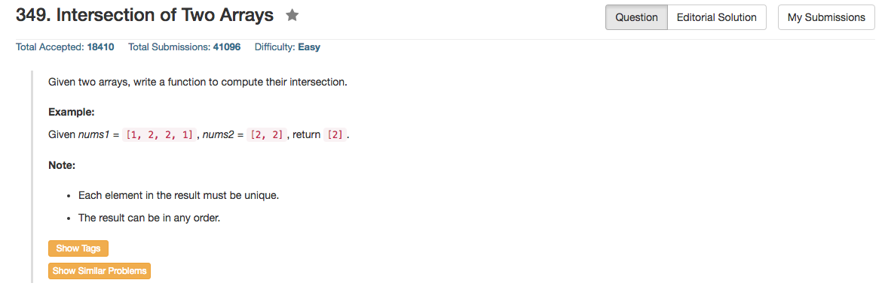

## Algorithm 

- C++的版本还是用了unordered_set来做整个操作；当然值得注意的是，要找出相交的集合，也就是说集合的元素必须是单一的。我最初的程序没有`hashMap.erase(findAnAnswer)`，结果就重复出现了多个。
- 这个题目算法其实很多
    1. 用hash table来做，如果保证find, insert, erase都是O(1)的就好。
    2. 可以把两个数组排序，然后直接扫一遍两个数组，遇到相同的就记录下来，时间O(NlogN)
    3. 当然也可以用Binary Search Tree，这样find, insert, erase都是O(logN)的，而且实际上不见得需要erase，只要记录一下这个值是否访问过就好了。

## Comment

- 依然是c++的vector和unordered_set的操作，更加厉害的写法我补充在了最后。

## Code

```C++
class Solution {
public:
    vector<int> intersection(vector<int>& nums1, vector<int>& nums2) {
        std:unordered_set<int> hashMap;
        vector<int> ans;
        int n = nums1.size(), m = nums2.size();
        for (int i = 0; i < n; i++) hashMap.insert(nums1[i]);
        for (int i = 0; i < m; i++)
            if (hashMap.find(nums2[i]) != hashMap.end()){
                ans.push_back(nums2[i]);
                hashMap.erase(nums2[i]);
            }
        return ans;
    }
};
```

```c++
class Solution {
public:
    vector<int> intersection(vector<int>& nums1, vector<int>& nums2) {
        unordered_set<int> m(nums1.begin(), nums1.end());
        vector<int> res;
        for (auto a : nums2)
            if (m.count(a)) {
                res.push_back(a);
                m.erase(a);
            }
        return res;
    }
};
```