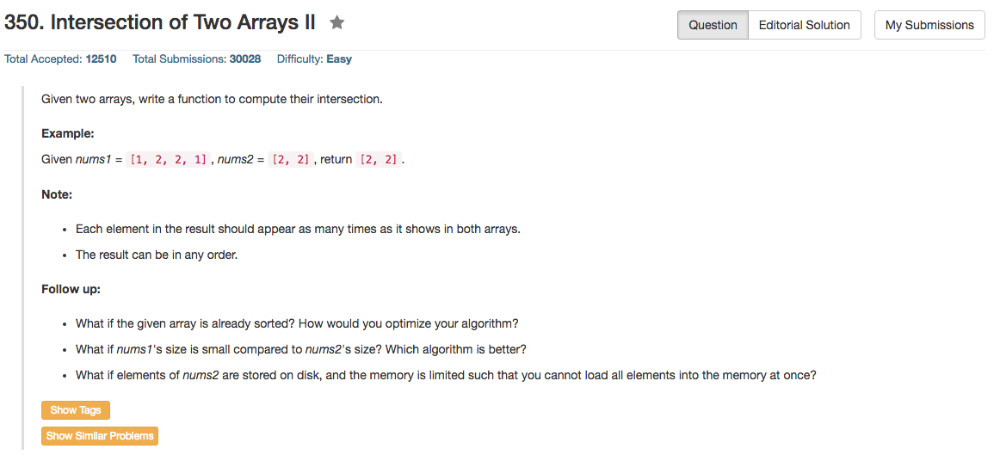

## Algorithm 

- 感觉这道题目跟349基本上没有区别，我唯一变了的就是从`unordered_set`变成了`unordered_map`，因为我需要多记录一个值来表示某个数出现了多少次。
- 这个题目有一个扩展问题说如果两个数组已经排好序了，应该怎么做：这样的话就真的是两个pointer扫一遍就好了，而且是O(max(m,n))的时间复杂度的。

## Comment

- 依然是c++的vector和unordered_map的操作，[这里](https://leetcode.com/discuss/103787/table-solution-pointers-solution-with-time-space-complexity)关于C++实现`unordered_map`的空间复杂度的讨论值得注意，理解为什么算法1和算法2的空间复杂度是不一样的。
- Two pointer的方法还挺有意思的，我写了一个。

## Code

```C++
class Solution {
public:
    vector<int> intersect(vector<int>& nums1, vector<int>& nums2) {
        std::unordered_map<int, int> hashMap;
        vector<int> ans;
        int n = nums1.size(), m = nums2.size();
        for (int i = 0; i < n; i++) {
            if (hashMap.find(nums1[i]) != hashMap.end()) 
                hashMap[nums1[i]] += 1;
            else
                hashMap[nums1[i]] = 1;
        }
        for (int i = 0; i < m; i++)
            if (hashMap.find(nums2[i]) != hashMap.end() && hashMap[nums2[i]] > 0){
                ans.push_back(nums2[i]);
                hashMap[nums2[i]] -= 1;
            }
        return ans;
    }
};
```

排序之后的算法，时间复杂度是O(max(n,m))的

```c++
class Solution {
public:
    vector<int> intersect(vector<int>& nums1, vector<int>& nums2) {
        vector<int> ans;
        sort(nums1.begin(), nums1.end());
        sort(nums2.begin(), nums2.end());
        int n = nums1.size(), m = nums2.size();
        for (int i = 0, j = 0; i < n && j < m; ){
            if (nums1[i] == nums2[j]){
                ans.push_back(nums1[i]);
                i++;
                j++;
            }else if (nums1[i] > nums2[j]){
                j++;
            }else{
                i++;
            }
        }
        return ans;
    }
};

```