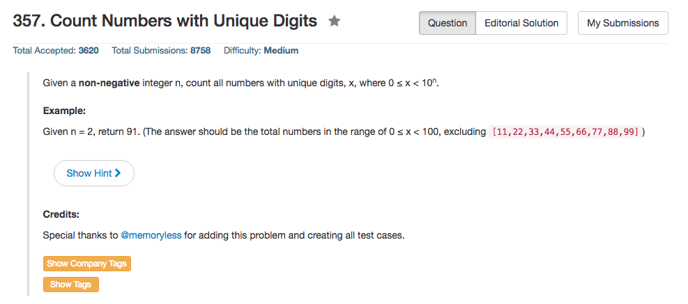

## Algorithm 

- 这个题目就是一个排列组合计数题。
    1. 一位数: 10种情况
    2. 两位数: 9 * 9种情况（第一位取1-9，第二位还有9种情况）
    3. 三位数: 9 * 9 * 8种情况
- 注意边界条件： `n==0`，返回`1`

## Comment

- 简单地说数学题。

## Code

额外用了O(N)的空间

```c++
class Solution {
public:
    int countNumbersWithUniqueDigits(int n) {
        if (n == 0) return 1;
        if (n == 1) return 10;
        int ans = 10, count = 9;
        for (int i = 2; i <= min(n, 10); i++){
            count = count * (10 - i + 1);
            ans = ans + count;
        }
        return ans;
    }
};
```