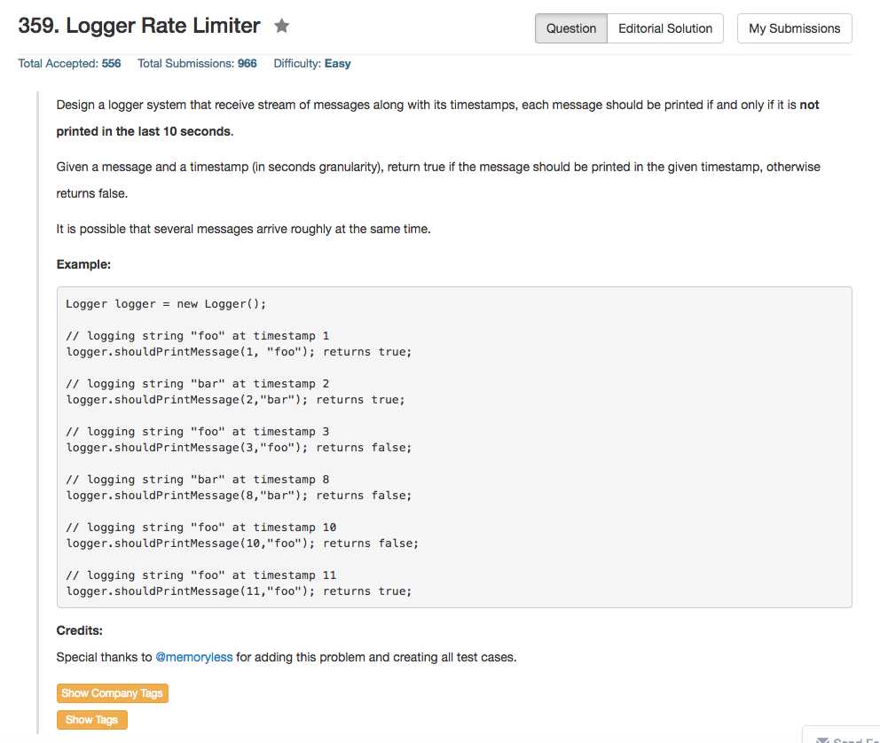

## Algorithm 

- 这个题目也没有别的想法吧，就是Hash Table咯。
- C++的话使用`unordered_map<string, int>`应该是最容易想到的解法了。

## Comment

- 仍然是C++的标准库的使用。

## Code

```c++
class Logger {
public:
    /** Initialize your data structure here. */
    std::unordered_map<string, int>Hash;
    Logger() {
        Hash.empty();  
    }
    
    /** Returns true if the message should be printed in the given timestamp, otherwise returns false.
        If this method returns false, the message will not be printed.
        The timestamp is in seconds granularity. */
    bool shouldPrintMessage(int timestamp, string message) {
        if (Hash.find(message) == Hash.end() || Hash[message] - timestamp <= -10){
            Hash[message] = timestamp;
            return true;
        } else {
            return false;
        }
    }
};
```