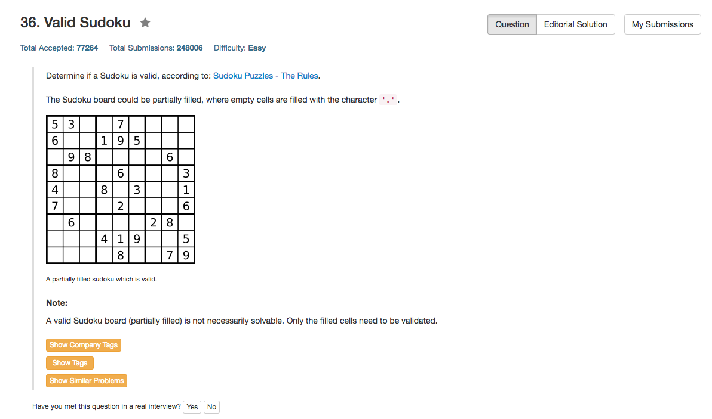

## Algorithm 

- 这个题目很简单，就是O(n^2)的遍历，重要的问题就是如何简单快捷地判断一个数是否存在于对应的判断区间：所在的行、所在的列、所在的单元格。当然直接的方法就是对于行、列、单元格做一个9*9的矩阵来记录数据。
- 当然，记录的方法可以用bool矩阵、整形矩阵，或者类似queen的问题一样直接用位运算。

## Comment

- Discussion可以看一下，因为有比较厉害而简洁的python程序。
- C和C++的程序，我的结果也差不多比较简洁了。
- 重要的问题是C的位运算是`&, |`，而逻辑运算时`&&, ||`，我一开始把这个搞混了，出了大问题。

## Code

```c
bool isValidSudoku(char** board, int boardRowSize, int boardColSize) {
    int colValid[9] = {0,0,0,0,0,0,0,0,0}, rowValid[9] = {0,0,0,0,0,0,0,0,0}, squareValid[9] = {0,0,0,0,0,0,0,0,0};
    for (int i = 0; i < boardRowSize; i++)
        for (int j = 0; j < boardColSize; j++)
            if (board[i][j] != '.'){
                int numJudge = 1 << (board[i][j] - '1');
                int squareLoc = i / 3 + 3 * (j / 3);
                if ((numJudge & rowValid[i]) || (numJudge & colValid[j]) || (numJudge & squareValid[squareLoc])){
                    return false;
                } else {
                    rowValid[i] |= numJudge;
                    colValid[j] |= numJudge;
                    squareValid[squareLoc] |= numJudge;
                }
            }
    return true;
}
```