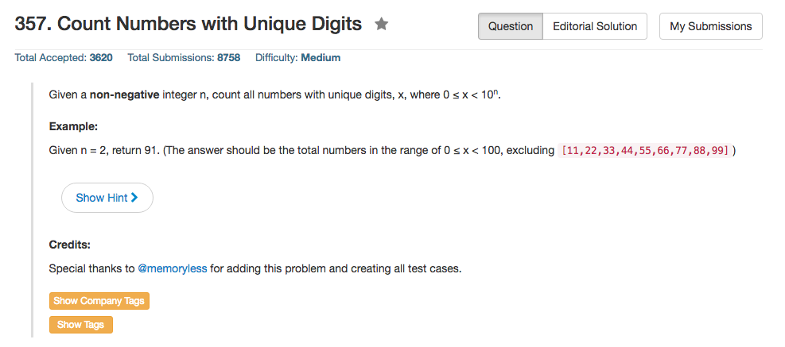

## Algorithm 

- 这还是一道数学题。
- 如果`a==0`，那么这是一个线性函数，由于原数组已经有序，新的数组就根据`b>=0`还是`b<0`依次放入对应位置就好了
- 如果`a>0`，那么这个函数是一个二次函数，最小值在`-b/2a`，我的方法A是找到这个最小值对应的x，然后再往两侧展开。类似的如果`a<0`，那么这个函数最大值在`-b/2b`，也是找到对应的x然后往两侧展开。
- 但是更好的方法是，这个数组的两端往中间走，如果`a>0`，那么第一个最小值一定出现在最左边或者最右边，然后逐渐往中间收缩就好了；类似的如果`a<0`那么第一个最大值一定出现在最左边或者最右边，然后往中间收缩就好了。

## Comment

- 这终究是一道数学题，但是把这道数学题写得优雅不是一件容易的事情。起码我的第一个版本就非常不优雅。
- 但是这个题目难度并不是很大

## Code

比较简洁的版本

```c++
class Solution {
public:
    vector<int> sortTransformedArray(vector<int>& nums, int a, int b, int c) {
        int left = 0, right = nums.size() - 1, sign, count;
        vector<int>ans(nums.size());
        if (a > 0 || (a == 0 && b < 0)) {
            sign = -1;
            count = nums.size() - 1;
        } else {
            sign = +1;
            count = 0;
        }
        while (left <= right){
            int tmp1 = a * nums[left] * nums[left] + b * nums[left] + c;
            int tmp2 = a * nums[right] * nums[right] + b * nums[right] + c;
            if (tmp1 * sign < tmp2 * sign){
                ans[count] = tmp1;
                left++;
            } else {
                ans[count] = tmp2;
                right--;
            }
            count = count + sign;
        } 
        return ans;
    }
};
```

我的第一个版本，程序非常复杂。

```c++
class Solution {
public:
    vector<int> sortTransformedArray(vector<int>& nums, int a, int b, int c) {
        int n = nums.size();
        vector<int>ans(n);
        if (a == 0) {
            if (b >= 0){
                for (int i = 0; i<n;i++) ans[i] = b * nums[i] + c; 
            } else {
                for (int i = 0; i<n;i++) ans[n - i - 1] = b * nums[i] + c;
            }
        } else {
            int step = (a < 0) ? -1 : +1;
            int count = (a < 0) ? (n - 1) : 0;
            float minX = - (float) b / (2 * (float) a);
            int midPoint = 0, i = 0;
            while (midPoint < n && nums[midPoint] < minX) midPoint ++;
            for (i = midPoint - 1; i >= 0 || midPoint < n;){
                if (i < 0) {
                    ans[count] = a * nums[midPoint] * nums[midPoint] + b * nums[midPoint] + c;
                    midPoint++;
                } else if (midPoint >= n) {
                    ans[count] = a * nums[i] * nums[i] + b * nums[i] + c;
                    i--;
                } else {
                    int tmp1 = a * nums[midPoint] * nums[midPoint] + b * nums[midPoint] + c;
                    int tmp2 = a * nums[i] * nums[i] + b * nums[i] + c;
                    printf("%d %d at %d\n", tmp1, tmp2, count);
                    if (a > 0){
                        ans[count] = min(tmp1, tmp2);
                        if (tmp1 < tmp2) {
                            midPoint++;
                        } else {
                            i--;
                        }
                    } else {
                        ans[count] = max(tmp1, tmp2);
                        if (tmp1 > tmp2) {
                            midPoint++;
                        } else {
                            i --;
                        }
                    }
                }
                count = count + step;
            }
        } 
        return ans;
    }
};
```