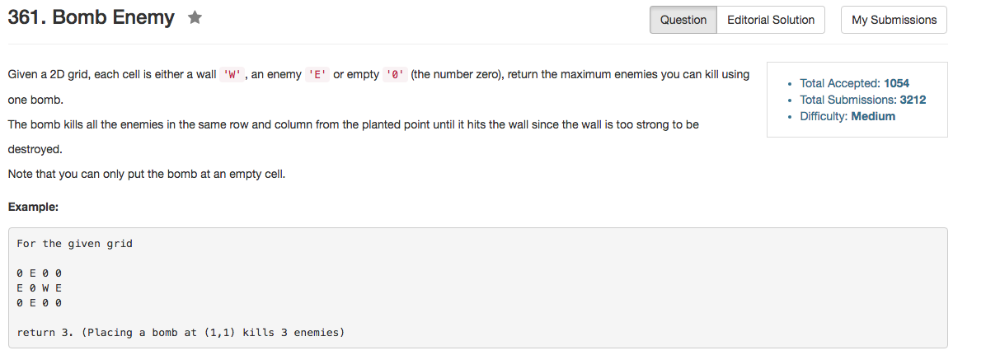

## Algorithm 

- 我用的是O(mn)的时间和O(mn)的空间来做的这道题目。据说[这里](https://discuss.leetcode.com/topic/48565/short-o-mn-solution)有O(mn)的时间，和O(n)的空间。
- 基本的思路是：
    1. `col[i][j]`表示把炸弹放在`[i][j]`位置，纵列能够炸多少个
    2. `row[i][j]`表示把炸弹放在`[i][j]`位置，横行能够炸多少个
    3. 显然结果就是`max(row[i][j] + col[i][j])`
    4. 要统计col[i][j]，就是一列扫一遍，如果遇到了`"E"`，那么经过的敌人总数加1；如果遇到了`"W"`，就把之前到过的格子全部填满，每一个这样格子都填上这一路一共经过了多少个敌人。这样的时间复杂度是O(mn)的，因为每个格子遍历了两次。
    5. 当然最后计算最大值的时候又是一个O(mn)的遍历。

## Comment

- 这个题目也就是这么写了，那个用O(n)的时间复杂的方法还是可以学习一下的。

## Code

```C++
class Solution {
public:
    int maxKilledEnemies(vector<vector<char>>& grid) {
        if (grid.size() == 0) return 0;
        int n = grid.size(), m = grid[0].size();
        int row[n][m] = {};
        int col[n][m] = {};
        for (int i = 0; i < n; i++){
            int start = 0, count = 0;
            for (int j = 0; j <= m; j++){
                if (j == m || grid[i][j] == 'W') {
                    for (int k = start; k < j; k++){
                        row[i][k] = count;
                    }
                    start = j + 1;
                    count = 0;
                } else if (grid[i][j] == 'E'){
                    count++;
                }
            }
        }
        for (int j = 0; j < m; j++){
            int start = 0, count = 0;
            for (int i = 0; i <= n; i++){
                if (i == n || grid[i][j] == 'W'){
                    for (int k = start; k < i; k++){
                        col[k][j] = count;
                    } 
                    start = i + 1;
                    count = 0;
                } else if (grid[i][j] == 'E'){
                    count ++;
                }
            }
        }
        int max = 0;
        for (int i = 0; i < n; i++)
            for (int j = 0; j < m; j++)
                max = ((max > col[i][j] + row[i][j]) || (grid[i][j] == 'E')) ? max : col[i][j] + row[i][j];
        return max;
    }
};
```

如果把上面的程序合并一下，然后用计数器节省一下空间，设计得好也是可以到如下的代码的，来自[这里](https://discuss.leetcode.com/topic/48565/short-o-mn-solution)

```C++
int maxKilledEnemies(vector<vector<char>>& grid) {
    int m = grid.size(), n = m ? grid[0].size() : 0;
    int result = 0, rowhits, colhits[n];
    for (int i=0; i<m; i++) {
        for (int j=0; j<n; j++) {
            if (!j || grid[i][j-1] == 'W') {
                rowhits = 0;
                for (int k=j; k<n && grid[i][k] != 'W'; k++)
                    rowhits += grid[i][k] == 'E';
            }
            if (!i || grid[i-1][j] == 'W') {
                colhits[j] = 0;
                for (int k=i; k<m && grid[k][j] != 'W'; k++)
                    colhits[j] += grid[k][j] == 'E';
            }
            if (grid[i][j] == '0')
                result = max(result, rowhits + colhits[j]);
        }
    }
    return result;
}
```