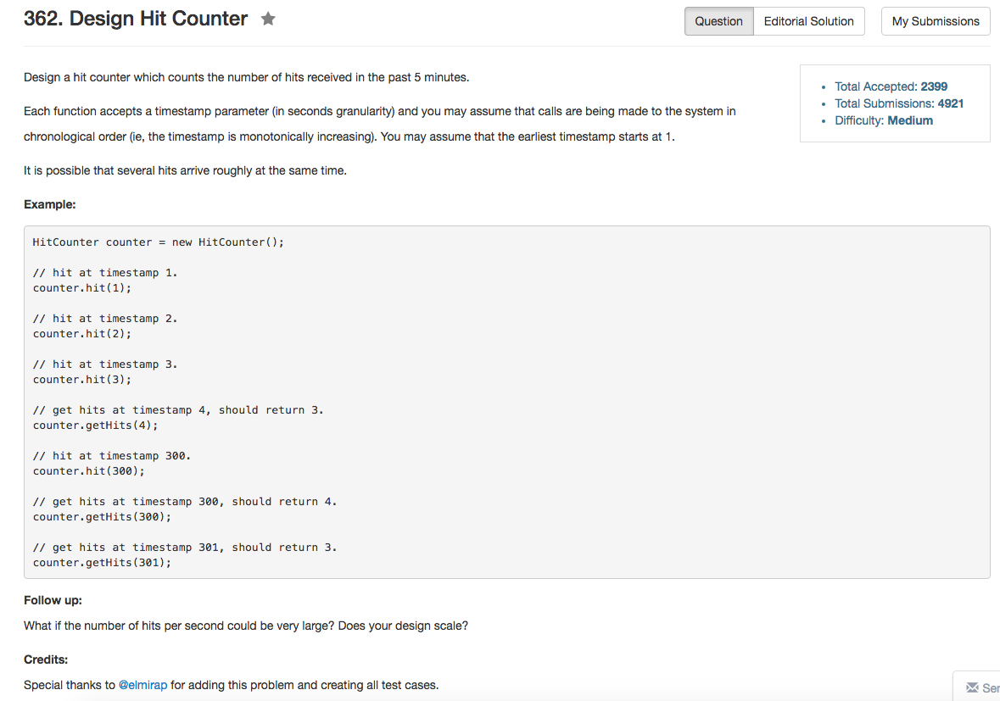

## Algorithm 

- 这个题目就是用queue就好了。如果有重复的那就用`pair<int, int>`来计数好了
- 在设计上，到底要在那个函数里面维护更新queue是个问题，[这里]()提到应该在`hit()`和`getHits()`中都更新queue，也是有道理。
- 我一开始是觉得如果哪个函数用的频率高，就把队列更新放到另一个函数里面就好了。但是如果两个函数中都更新，那么整体队列长度会控制的比较好，所以平均下来更新的负担也就比较轻一点，不失为一个选择。

## Comment

- 这个题目主要是scalability的问题

## Code


```C++
class HitCounter {
public:
    /** Initialize your data structure here. */
    HitCounter() {
        total = 0;
    }
    
    /** Record a hit.
        @param timestamp - The current timestamp (in seconds granularity). */
    void hit(int timestamp) {
        //也可以在这里更新queue
        //while (record.size() && record.front().first <= timestamp - 300){
        //    total -= record.front().second;
        //    record.pop();
        //}

        if (record.size() && timestamp == record.back().first){
            record.back().second++;
        } else {
            record.push(pair<int, int>{timestamp, 1});
        }
        total++;
    }
    
    /** Return the number of hits in the past 5 minutes.
        @param timestamp - The current timestamp (in seconds granularity). */
    int getHits(int timestamp) {
        while (record.size() && record.front().first <= timestamp - 300){
            total -= record.front().second;
            record.pop();
        }
        return total;
    }
private:
    queue<pair<int, int>> record;
    int total;
};

/**
 * Your HitCounter object will be instantiated and called as such:
 * HitCounter obj = new HitCounter();
 * obj.hit(timestamp);
 * int param_2 = obj.getHits(timestamp);
 */
```
