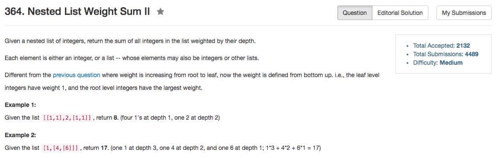

## Algorithm 

- 这个题目我能直接想到的方法是two-pass，先找深度，在根据对应的深度进行加权。
- 但是[这里](https://discuss.leetcode.com/topic/49041/no-depth-variable-no-multiplication)的one-pass的方法非常巧妙，思路值得学习。
- one-pass的思路是这样的：每次累积加和。
    - 当前层的所有is.Integer()的全部弄出来，先加和这一堆
    - 然后把当前所有不是Integer的子集组成一个新的nestedList，进入下一层。
    - 重要的是，在下一层计算的时候，要把之前提取出来的is.Integer()的所有数又再次累加一遍。
    - 这样的话，第一层的integer，在每深入一层的时候，就又多加和了一次，等到深入第k层的，实际上一共就被加和了k次。
    - 以上也就是`total`和`mergeTotal`的区别。思路很有意思！

## Comment

- 合并两个vector的方法：`v1.insert(v1.end(), v2.begin(), v2.end())`，但是这样是复制了v2里面所有的元素到v1中。C++11可以使用move_iterator，但是速度上并没有快更多。

## Code


```C++
class Solution {
public:
     int depthSumInverse(vector<NestedInteger>& nestedList) {
         int total = 0, mergeTotal = 0;
         while (!nestedList.empty()){
             vector<NestedInteger> nextLevel;
             for (auto item : nestedList){
                 if (item.isInteger()){
                     mergeTotal += item.getInteger();
                 } else {
                     vector<NestedInteger> tmp = item.getList();
                     nextLevel.insert(nextLevel.end(), tmp.begin(), tmp.end());
                 }
             }
             total += mergeTotal;
             nestedList = nextLevel;
         }
         return total;
     }
 
};
```
