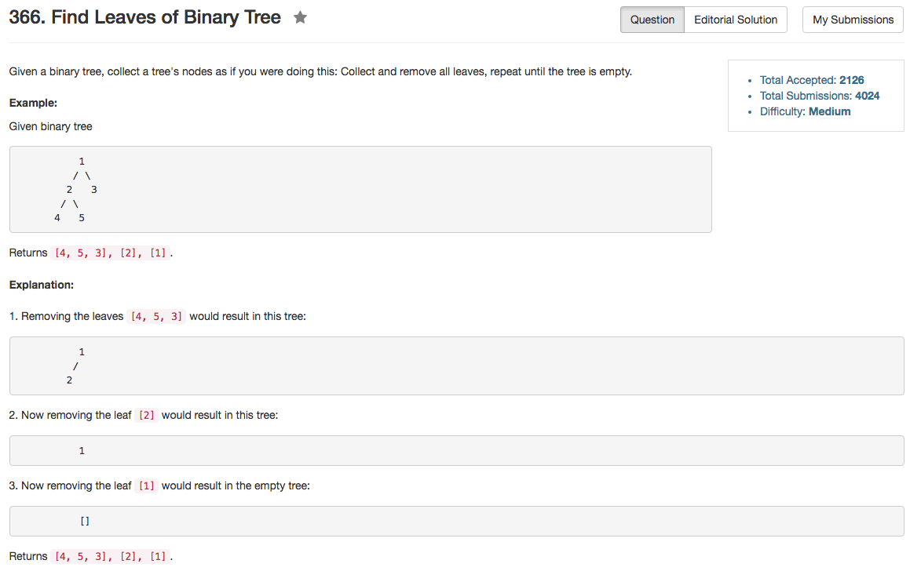

## Algorithm 

- 这个题目归根究底其实可以认为是后序遍历。主要是要知道把每一个结点放到正确的位置。
- 实际上就是把结点`i`放在他的深度的那一格里面，而我们以叶子节点的深度为0，中间节点的深度是左右子树深度最大值加1。
- 我写的程序很丑，但是[这里](https://discuss.leetcode.com/topic/49267/c-short-easy-understanding-dfs-solution)的程序很好

## Comment

- vector的size是一个特殊的类型，所以如果要用一个int变量与vector.size()比较，需要考虑`currentDepth + 1 > (int)ans.size() `这里提到的`(int)`来装换变量类型。

## Code

以下是来自[这里](https://discuss.leetcode.com/topic/49267/c-short-easy-understanding-dfs-solution)的程序，非常简洁！

```C++
class Solution {
private:
    int dfs(TreeNode* root, vector<vector<int>>& res){
        if(!root) return 0;
        int level = max(dfs(root->left, res), dfs(root->right, res)) + 1;
        if(level > (int)res.size()) res.push_back(vector<int>());
        res[level - 1].push_back(root->val);
        return level;
    }
public:
    vector<vector<int>> findLeaves(TreeNode* root) {
        vector<vector<int>> res;
        dfs(root, res);
        return res;
    }
};
```

以下是我自己的程序

```C++
class Solution {
public:
    vector<vector<int>> findLeaves(TreeNode* root) {
        vector<vector<int>> ans;
        int treeDepth = depth(ans, root);
        return ans;
    }
private:
    int maxDepth = -1;
    int depth(vector<vector<int>>& ans, TreeNode* root){
        int currentDepth = 0;
        if (root == NULL) return -1;
        if (root->left == NULL && root->right == NULL){
            currentDepth = 0;
        } else {
            int depthLeft = depth(ans, root->left);
            int depthRight = depth(ans, root->right);
            currentDepth = (depthLeft > depthRight) ? depthLeft + 1 : depthRight + 1;
        }
        if (currentDepth > maxDepth){
            maxDepth = currentDepth;
            vector<int> tmp;
            tmp.push_back(root->val);
            ans.push_back(tmp);
        } else {
            ans[currentDepth].push_back(root->val);
        }
        return currentDepth;
    }
};
```

接下来这个是我根据最上面的写得很好的程序来调整的我自己的程序

```C++
class Solution {
public:
    vector<vector<int>> findLeaves(TreeNode* root) {
        vector<vector<int>> ans;
        int treeDepth = depth(ans, root);
        return ans;
    }
private:
    int depth(vector<vector<int>>& ans, TreeNode* root){
        int currentDepth = 0;
        if (root == NULL) return -1;
        if (root->left == NULL && root->right == NULL){
            currentDepth = 0;
        } else {
            currentDepth = max(depth(ans, root->left),  depth(ans, root->right)) + 1;
        }
        if (currentDepth + 1 > (int)ans.size() ){
            ans.push_back(vector<int>());
        }
        ans[currentDepth].push_back(root->val);
        return currentDepth;
    }
};
```