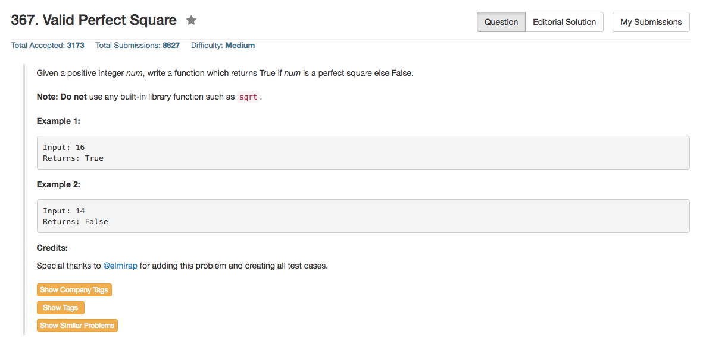

## Algorithm 

- 这个题目本质上跟之前那个sqrt是一样的
- 涉及到sqrt基本上就几种方法
    1. 二分
    2. 牛顿迭代，比如[这里](https://leetcode.com/discuss/110671/3-4-short-lines-integer-newton-most-languages)就写得非常好。
    3. 神奇的[Fast Root](https://en.wikipedia.org/wiki/Fast_inverse_square_root)，我觉得面试上面没有人会写这个。但是[这里](https://leetcode.com/discuss/110659/o-1-time-c-solution-inspired-by-q_rsqrt)有人写了这个题目对应的版本，也是挺厉害的。
    4. 有时间可以看一下[这里](https://leetcode.com/discuss/111488/no-multiply-divide-good-for-big-integers)写的大整数开方的程序，蛮有意思的。

## Comment

- 这道题目倒是比较基础的two pointer linked list的题目。

## Code

```C
class Solution {
public:
    bool isPerfectSquare(int num) {
        int left = 1, right = 1 << 16;
        while (left < right){
            int mid = left + (right - left) / 2;
            if (mid * mid == num) 
                return true;
            else if (mid < num / mid)
                left = mid + 1;
            else 
                right = mid - 1;
        }
        return left * left == num;
    }
};
```

[这里](https://leetcode.com/discuss/81397/simple-c-solution-o-n-time-o-1-space)的程序是简洁的牛顿迭代。

```c++
class Solution {
public:
    bool isPerfectSquare(int x) {
        long r = x;
        while (r*r > x)
            r = (r + x/r) / 2;
        return r*r == x;
    }
};
```


