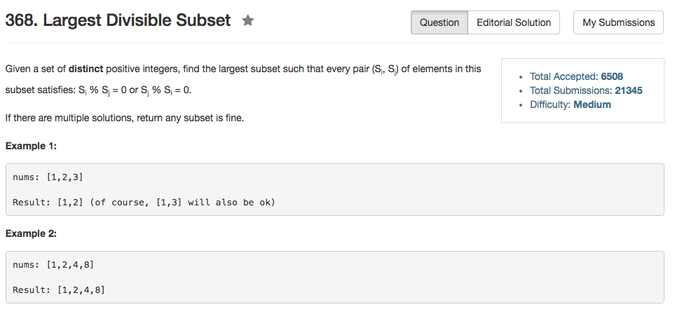

## Algorithm 

- 这道题目就是非常基础的动态规划，或者说是计数问题
- 一开始只想到了O(N^2)的算法，开始以为有更快的，但是看了一圈论坛发现都是O(N^2)的，所以看来也没有比我想到的更快的算法了。
- 思路比较简单
    1. 排序，是的`nums`从小到大排序
    2. 动规，对于每一个位置`i`，如果之前的某一个位置`j`满足`nums[i] % nums[j] == 0`而且`length[j] + 1 > length[i]`，那么更新`length[i]`，同时记录`i`位置当前状态是由`j`位置过来的。

## Comment

- 好吧，既然是O(N^2)的算法，其实蛮好想的。
- 边界条件是个问题！边界条件是个问题！
- `nums.size() == 0` 和 `nums.size() == 1`的时候

## Code

```C++
class Solution {
public:
    vector<int> largestDivisibleSubset(vector<int>& nums) {
        if (!nums.size()) return vector<int>();
        sort(nums.begin(), nums.end());
        int n = nums.size(), maxResult = 1, maxResultIndex = 0;
        vector<int> record(n, 1), parent(n, -1);
        for (int i = 1; i != n; i++){
            for (int j = i - 1; j >= 0; j--){
                if (nums[i] % nums[j] == 0 && record[j] + 1 > record[i]) {
                    record[i] = record[j] + 1;
                    parent[i] = j;
                }
            }
            if (record[i] > maxResult) {
                maxResult = record[i];
                maxResultIndex = i;
            }
        }
        vector<int> result(maxResult, 0);
        while (maxResultIndex >= 0){
            result[--maxResult] = nums[maxResultIndex];
            maxResultIndex = parent[maxResultIndex];
        }
        return result;
    }
};
```
