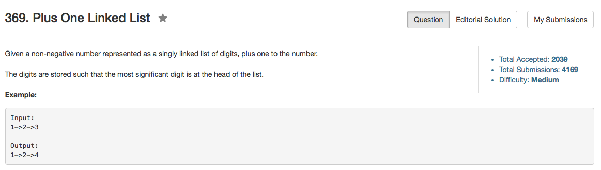

## Algorithm 

- 这道题目有两种解法：递归，或者用reverse()
  1. 用递归的方法：如果不是最后一个结点，就先递归，处理下一个结点，计算完了以后再回溯到当前节点，进行加法。
  2. 用reverse()就是先把整个链表倒过来，然后从低位加1，然后再reverse()一遍。

## Comment

- 最早在bloomberg面试的时候是假设提供了reverse来做，后来看到有人用递归，绝对简直太棒了。


## Code

递归的写法

```c++
class Solution {
public:
    ListNode* plusOne(ListNode* head) {
        static int addition = 0, count = 0;
        count += 1;
        if (head->next == NULL){
            head->val = head->val + 1;
        } else {
            head->next = plusOne(head->next);
            head->val = head->val + addition;
        }
        if (head->val >= 10){
            addition = 1;
            head->val = head->val - 10;
        } else {
            addition = 0;
        }
        count -= 1;
        if (count == 0 && addition != 0){
            ListNode* newHead = new ListNode(addition);
            newHead->next = head;
            head = newHead;
        }
        return head;
    }

};
```

用reverse()的写法

```c++
/**
 * Definition for singly-linked list.
 * struct ListNode {
 *     int val;
 *     ListNode *next;
 *     ListNode(int x) : val(x), next(NULL) {}
 * };
 */
class Solution {
public:
    ListNode* plusOne(ListNode* head) {
        head = reverse(head);
        ListNode* ptr = head;
        int addition = 1;
        while (ptr->next != NULL) {
            ptr->val += addition;
            addition = ptr->val / 10;
            ptr->val = ptr->val % 10;
            ptr = ptr->next;
        }
        if (ptr->val + addition < 10){
            ptr->val += addition;
        } else {
            ptr->val = 0;
            ListNode* newNode = new ListNode(1);
            ptr->next = newNode;
        }
        head = reverse(head);
        
        return head;
    }
private:
    ListNode* reverse(ListNode* head){
        ListNode* ptr = head->next, *tmp;
        head->next = NULL;
        while (ptr != NULL){
            tmp = ptr->next;
            ptr->next = head;
            head = ptr;
            ptr = tmp;
        }
        return head;
    }

};
```