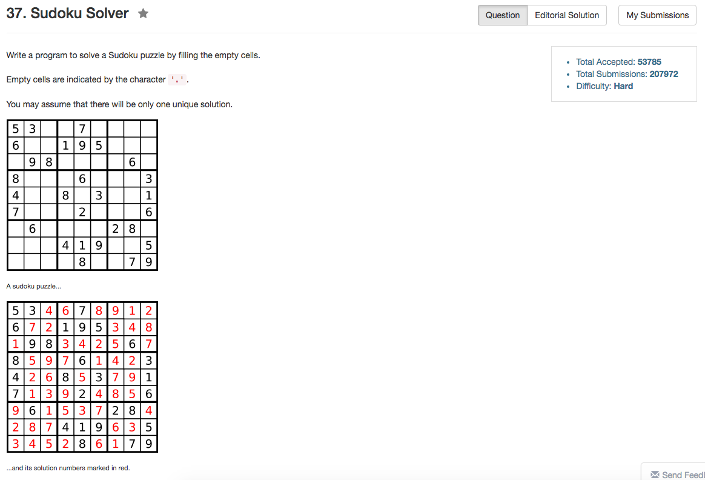

## Algorithm 

- 这就是一个暴力深搜，没什么特别的
- 唯一特别的就是判断条件的时候用位操作判断罢了。

## Comment

- 好久没有写深搜，结果这个深搜写了好久，写错好几次。
- 错误之一在于位操作没有搞清楚
- 错误之二在于深搜回溯的时候复原没有到位
- 错误之三在于计算方框坐标算错了。

## Code

```c++
class Solution {
public:
    void solveSudoku(vector<vector<char>>& board) {
        int n = board.size(), m = board[0].size();
        for (int i = 0; i < 9; i++){
            row[i] = (1 << 9) - 1;
            col[i] = (1 << 9) - 1;
            square[i] = (1 << 9) - 1;
        }
        for (int i = 0; i < 9; i++)
            for (int j = 0; j < 9; j ++){
                int s = 3 * (i / 3) + j / 3;
                if (board[i][j] != '.'){
                    int mask = 1 << (board[i][j] - '1');
                    row[i] ^= mask;
                    col[j] ^= mask;
                    square[s] ^= mask;
                }
            }
        bool succeed = search(board, 0, 0);
    }
private:
    int row[9], col[9], square[9];
    bool search(vector<vector<char>>& board, int i, int j){
        if (j > 8) {
            j = 0;
            ++i;
        }
        if (i > 8) {
            return true;
        }
        int s = 3 * (i / 3) + j / 3;
        if (board[i][j] == '.') {
          for (int k = 0; k < 9; k++){
              int mask = 1 << k;
              if ((row[i] & mask) && (col[j] & mask) && (square[s] & mask)) {
                  board[i][j] = k + '1';
                  row[i] ^= mask;
                  col[j] ^= mask;
                  square[s] ^= mask;
                  if (search(board, i, j + 1)){
                      return true;
                  }
                  board[i][j] = '.';
                  row[i] ^= mask;
                  col[j] ^= mask;
                  square[s] ^= mask;
              }
          }   
          return false;
        } else {
          return search(board, i, j + 1);
        }
    }
};
```
