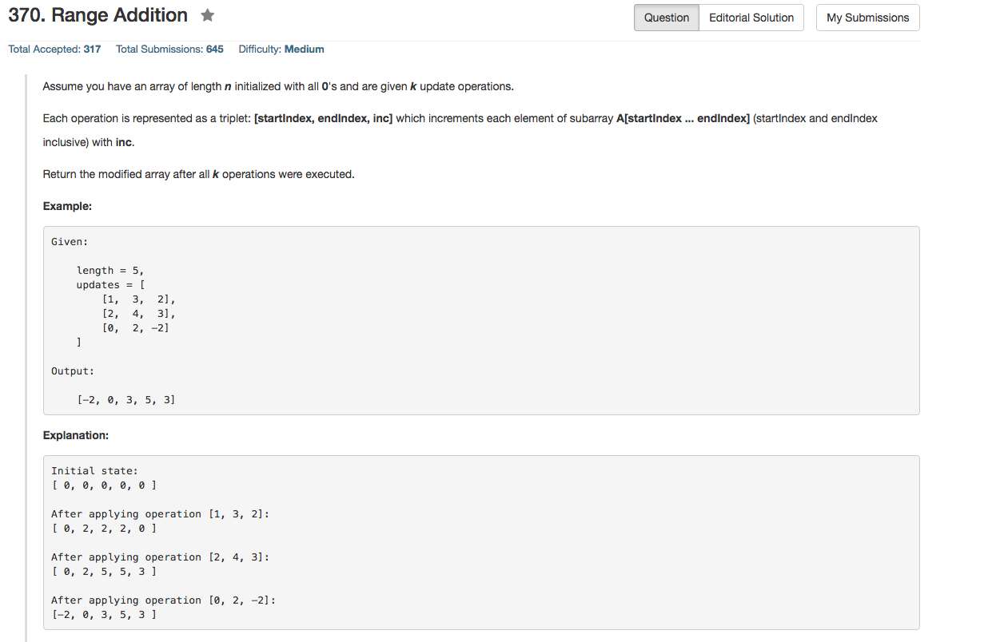

## Algorithm 

- 老实说，第一眼的确是想到了线段树，但是觉得线段树太难写了，真的不想写。然后看了提示（见下面）。
- 这个题目看到最优算法用O(k+n)的时间复杂度，基本上就不考虑复杂的算法了，而且这种区间和让人想到肯定可以累加，所以应该不需要记录中间的每一个因素
- 然而第二个简单的想法就是k个updates排个序，然后我们就知道从哪个元素开始要加上多少，哪个元素开始停止这个加法，这样的话，我们就只需要维持一个计数器不断更新就好了，这个我觉得应该可以做到O(klogk + n)
- 但是这还是非最优算法，最后就想到了现在的算法
    1. `[start, end, inc]`这样的指令，我们就从`start`往后都_加上_`inc`，但是从`end+1`之后在_减去_`inc`，这样我们就可以保证`end+1`之后的`净更新量 = 0`了。
    2. 根据上面的想法，我们对k个指令循环更新一遍。这样的话，得到一个数组，`a[i]`表示答案从`i`开始往后要加上`a[i]`这个量
    3. 根据上面那个数组，从头到尾算一遍部分和，结果就是答案了。这个时候，数组`i`位置的值就是所有updates在这个位置的总和。
- 这个题目如果告诉了你最优时间复杂度，其实不难想。最多再提示你一下只要考虑`start`和`end`就好了。

## Comment

- 提示如下

<pre>
1. Thinking of using advanced data structures? You are thinking it too complicated.
2. For each update operation, do you really need to update all elements between i and j?
3. Update only the first and end element is sufficient.
4. The optimal time complexity is O(k + n) and uses O(1) extra space.
</pre>

## Code

```c++
class Solution {
public:
    uint32_t reverseBits(uint32_t n) {
        uint32_t result = 0;
        for (int i = 0; i < 32; i++) result = (result << 1) | ((n >> i) & 1);
        return result;
    }
};
```

更加快的解法，来自上面的链接

```c++
class Solution {
public:
    uint32_t reverseBits(uint32_t n) {
        n = (n >> 16) | (n << 16);
        n = ((n & 0xff00ff00) >> 8) | ((n & 0x00ff00ff) << 8);
        n = ((n & 0xf0f0f0f0) >> 4) | ((n & 0x0f0f0f0f) << 4);
        n = ((n & 0xcccccccc) >> 2) | ((n & 0x33333333) << 2);
        n = ((n & 0xaaaaaaaa) >> 1) | ((n & 0x55555555) << 1);
        return n;
    }
};
```