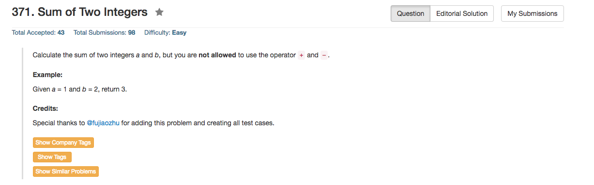

## Algorithm 

- 既然不允许用`+`和`-`，那想一下就知道是用位操作了，现在的问题就是怎么样进行位操作。
- 要用二进制的表征来看待数字a和b，如果用二进制加法，就很简单，结果每一位不是0就是1。
- 首先，我们不考虑进位的问题，两个二进制数加法得到的存留下来的结果是什么？
	- `0+0=0; 0+1=1; 1+0=1; 1+1=0`——这就是xor操作。
	- 所以不考虑进位的问题，结果是`a ^ b`
- 然后我们考虑，那些位要进位？
	- `0+0->0; 0+1->0; 1+0->0; 1+1->1`，也就是说只有两个数在某一位都是1的时候才进位
	- 所以，进位的结果是`a & b`
- 经过上面的思考，我们可以发现`a + b = (a ^ b) + ((a & b) << 1)`;
	- 右边第一部分是加法不考虑进位的结果
	- 右边第二部分是加法进位的结果
- 当然，我们仍然不能使用`+`和`-`，所以等式的右边部分还是要用上面同样的方法来进行加法运算，这样的加法直到最后进位为0的时候截止。这样也就有了我们的算法，可以写成递归，也可以直接写循环。

## Comment

- 位运算充满了乐趣。
- 但是感觉这个要循环，还不如直接加法吧。感觉这种基本运算单一运算的速度是一样的。然后这只是猜想，我并不了解。

## Code

```c++
class Solution {
public:
    int getSum(int a, int b) {
        int addition = 0, ans = 0, tmp = 0;
        addition = (a & b) << 1;
        ans = a ^ b;
        while (addition){
            tmp = (addition & ans) << 1;
            ans = ans ^ addition;
            addition = tmp;
        }
        return ans;
    }
};
```

[这里](https://leetcode.com/discuss/111562/c-bit-manipulation)有一个更加整合的版本

```c++
class Solution {
public:
    int getSum(int a, int b) {
        while(b){
            int carry = a & b;
            a ^= b;
            b = carry << 1;
        }
        return a;
    }
};
```
