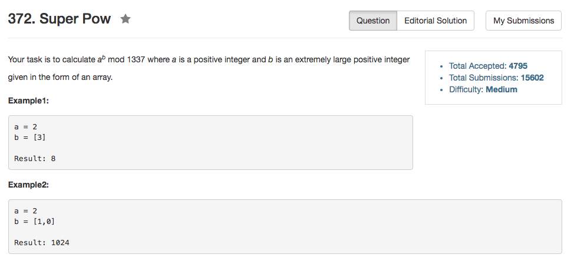

## Algorithm 

- 这个题目没什么好说的，就是一个大整数除以2和一个幂的运算。
- 我都直接没有把数组reverse就直接写也是可以的。

## Comment

- 要注意在每一个位置都`% 1337`

## Code

```C++
class Solution {
public:
    int superPow(int a, vector<int>& b) {
        a = a % 1337;
        int ans = 1;
        int n = b.size(), valid = 0;
        while (valid < n){
           if (b[n - 1] & 1) ans = (ans * a) % 1337;
           int add = 0;
           for (int i = valid; i != n; i++){
               if (i + 1 < n) b[i + 1] += 10 * (b[i] & 1);
               b[i] = (b[i] + add * 10) >> 1;
           } 
           while (valid < n && b[valid] == 0){
               valid++;
           }
           a = (a * a) % 1337;
        }
        return ans;
    }
};
```

