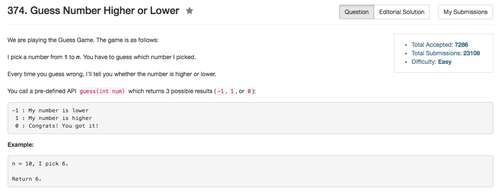

## Algorithm 

- 这题就是赤裸裸的二分搜索，没什么好说的。

## Comment

- 要把好的二分搜索写得烂熟于心。


## Code


```c++
// Forward declaration of guess API.
// @param num, your guess
// @return -1 if my number is lower, 1 if my number is higher, otherwise return 0
int guess(int num);

class Solution {
public:
    int guessNumber(int n) {
        int left = 1, right = n;
        while (left <= right){
            int mid = left + (right - left) / 2;
            int guessResult = guess(mid);
            if (guessResult == 0){
                return mid;
            } else if (guessResult > 0) {
                left = mid + 1;
            } else {
                right = mid - 1;
            }
        }
        return -1;
    }
};
```

