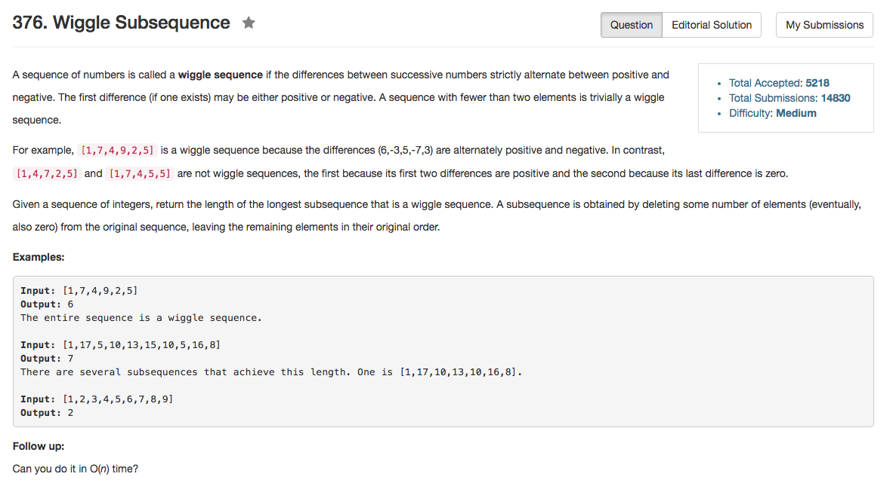

## Algorithm 

- 这道题目说白了是贪心，但是我只有直觉，没有完整的证明。
- 如果`i < j < k` 而且 `nums[i] < nums[j] < nums[k]`，为了使得将来的序列最长，我们其实会选择`i`和`k`两个数。也就是说，如果是一个递增的pair，我们希望后一个数越大越好；如果是一个递减的pair，我们希望后一个数越小越小。这样的结果就是：
    1. 如果是一个递增序列，我们只会选取第一个数和最后一个数，例如：3,1,2,3,4,5 -> 3, 1, 5
    2. 如果是一个递减序列，我们只会选取第一个数和最后一个数，例如：4,6,3,2,1,0 -> 4, 6, 0
    3. 所以我们说白了就是只要统计有多少次递增序列变成递减序列的转折
    4. 当然，我们还要考虑相等的情况——这样我们就是在考虑非升和非降的序列了。

## Comment

- 相等的情况作为边界条件要注意。

## Code

```C++
class Solution {
public:
    int wiggleMaxLength(vector<int>& nums) {
        int n = nums.size();
        if (n < 2) return n;
        int first = 0, second = 1, count = 2;
        while (second < n && nums[second] == nums[first]) second++;
        if (second >= n) return 1;
        for (int third = second + 1; third < n; third++){
            if ((nums[first] < nums[second] && nums[second] <= nums[third]) ||
                (nums[first] > nums[second] && nums[second] >= nums[third])){
                    second = third;
                } else {
                    count++;
                    first = second;
                    second = third;
                }
        }
        return count;
    }
};
```
