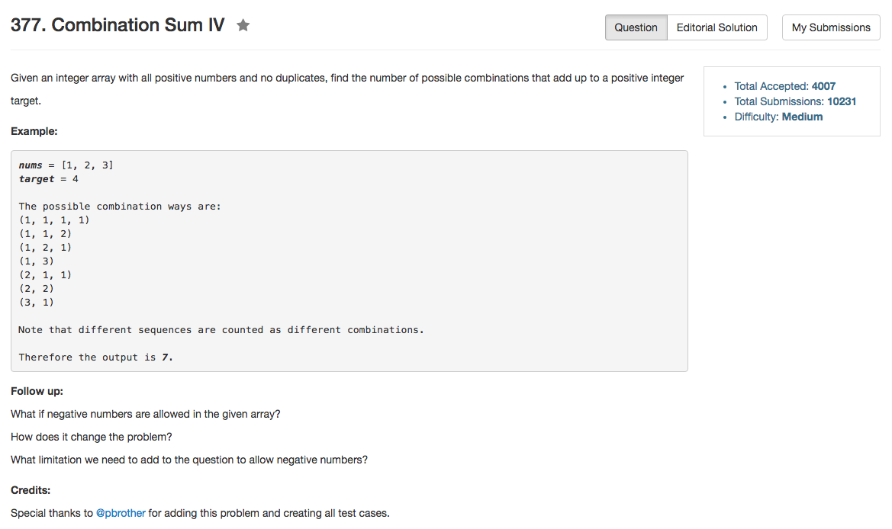

## Algorithm 

- 说是DP，但是实际上就是有记忆的搜索
- 用DP的思路说：`count[target] = sum(count[target - nums[i]])`，然后枚举`nums[i]`
- 但是实际上还是要深搜，只是如果某一个`target`之前已经遇到过了，就直接读结果好了
- 这本质上还是0/1背包问题

## Comment

- unordered_map的寻找语句需要`.find() != .end()`，因为寻找语句返回的是iterator

## Code


```C++
class Solution {
public:
    int combinationSum4(vector<int>& nums, int target) {
        return DFS(nums, target);
    }
private:
    unordered_map<int, int>searchMemory;
    int DFS(vector<int>& nums, int target){
        if (target < 0) {
            return 0;
        } else if (target == 0){
            return 1;
        } else if (searchMemory.find(target) != searchMemory.end()){
            return searchMemory[target];
        } else {
            int count = 0, n = nums.size();
            for (int scan = 0; scan != n; scan++){
                count = count + DFS(nums, target - nums[scan]);
            }
            searchMemory[target] = count;
            return count;
        }
    }
};
```

来自[这里](https://discuss.leetcode.com/topic/52217/6-lines-c-dp-solution)的6行解法，但是这个空间复杂度有点高啊，内存开的有点大吧。

```C++
    int combinationSum4(vector<int>& nums, int target) {
        vector<int> result(target + 1);
        result[0] = 1;
        for (int i = 1; i <= target; ++i) {
            for (int x : nums) {
                if (i >= x) {
                    result[i] += result[i - x];
                }
            }
        }
        
        return result[target];
    }
```