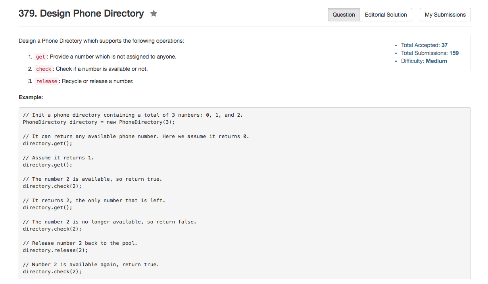

## Algorithm 

- 这个题目卡时间卡的有点狠，我最后是看了[这里](https://discuss.leetcode.com/topic/53098/c-two-array-solution)才发现这道题目要求也是太紧了
- 用`vector.push_back()`和用`unordered_map`来做的话，这道题目就超时了。必须使用预先分配内存的vector，必须使用数组来作hash，STL在这道题里面充分表现出速度的缓慢——虽然时间复杂度理论上是O(1)的。

## Comment

- 这道题目卡时间也是的确是强调设计。

## Code

```c++
class PhoneDirectory {
public:
    /** Initialize your data structure here
        @param maxNumbers - The maximum numbers that can be stored in the phone directory. */
    PhoneDirectory(int maxNumbers): available(maxNumbers, 0), used(maxNumbers,0), indexAvail(maxNumbers - 1){
        for (int i = 0; i < maxNumbers; i++) available[i] = i; 
    }
    
    /** Provide a number which is not assigned to anyone.
        @return - Return an available number. Return -1 if none is available. */
    int get() {
        if (indexAvail < 0){
            return -1;
        } else {
            int getNum = available[indexAvail--];
            used[getNum] = 1;
            return getNum;
        }
    }
    
    /** Check if a number is available or not. */
    bool check(int number) {
        return used[number] == 0;
    }
    
    /** Recycle or release a number. */
    void release(int number) {
        if (used[number]) {
            available[++indexAvail] = number;
        }
        used[number] = 0;
    }
private: 
    int indexAvail;
    vector<int> available, used;
};

```