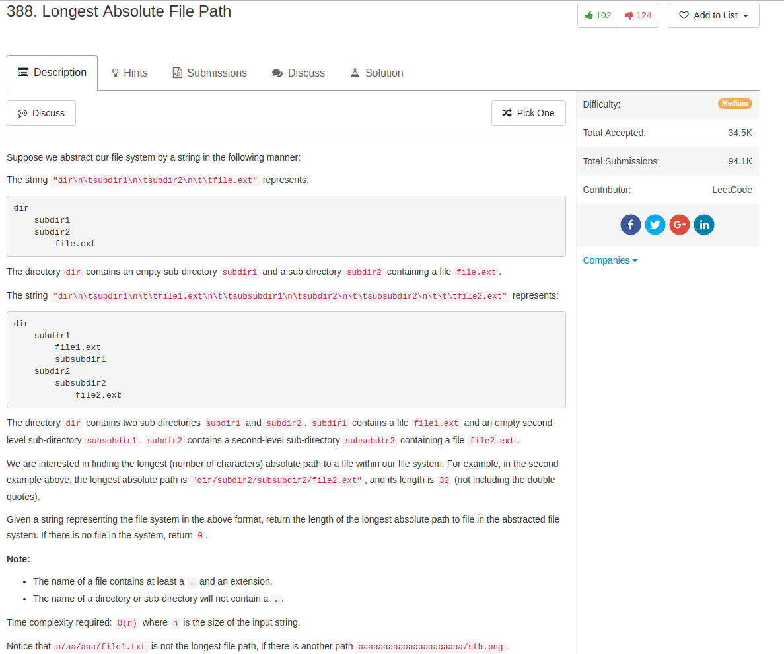

## Algorithm

- 这题目也是String操作，但是操作起来细节要注意。Stefan Pochmann的方法是设定一个dict来保存给下一个深度前缀长度，我觉得写的很好。

## Comment

- `\n`和`\t`都是一个字符！

## Code

[Stefan的非常漂亮的解](https://discuss.leetcode.com/topic/55097/simple-python-solution)：

```python
def lengthLongestPath(self, input):
    maxlen = 0
    pathlen = {0: 0}
    for line in input.splitlines():
        name = line.lstrip('\t')
        depth = len(line) - len(name)
        if '.' in name:
            maxlen = max(maxlen, pathlen[depth] + len(name))
        else:
            pathlen[depth + 1] = pathlen[depth] + len(name) + 1
    return maxlen
```

我的一开始的解，写的非常丑

```python
class Solution(object):
    def ins(self, stack, level, segment):
        while len(stack) > 0 and stack[-1][0] >= level:
                del stack[-1]
        if stack:
            stack.append((level, stack[-1][1] + 1 + len(segment)))
        else:
            stack.append((level, len(segment)))
        return stack

    def lengthLongestPath(self, _input):
        """
        :type input: str
        :rtype: int
        """
        max_len, ind = 0, 0
        _input += '\n'
        n = len(_input)
        segment, level = [], 0
        stack = []
        while ind < n:
            if _input[ind] == '\n':
                stack = self.ins(stack, level, segment)
                if '.' in segment:
                    max_len = max(max_len, stack[-1][1])
                level = 0
                segment = []
            elif _input[ind] == '\t':
                level += 1
            else:
                segment.append(_input[ind])
            ind += 1
        return max_len
```
