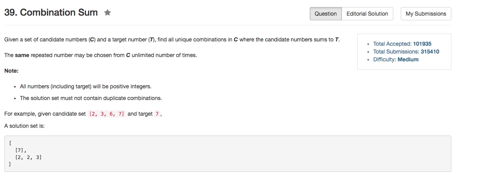

## Algorithm 

- 这个题目就是回溯。
- 主要的难点在于判重，我一开始纠结了好久。
- 现在使用的方法是：每次都从整个数组里面选一个数，但是有一个条件：最新选的数值要比之前选的最小的大。因为我一开始把整个数组排序了，所以这样就决定了答案序列必须是非降的序列，这样可以保证产生的答案的唯一性。

## Comment

- 感觉程序写的其实不是很好看，但是已经是精简过了。
- 这个题目本质上就是背包问题，经典回溯。

## Code

```C++
class Solution {
public:
    vector<vector<int>> combinationSum(vector<int>& candidates, int target) {
        sort(candidates.begin(), candidates.end());
        search(candidates, 0, target);
        return results;
    }
private:
    vector<vector<int>> results;
    vector<int> tmpResults;
    void search(vector<int>& candidates, int minimal, int target){
        if (!target){
            results.push_back(tmpResults);
            return;
        }
        for (int i = 0; i != candidates.size(); i++){
            if (candidates[i]>=minimal && target >= candidates[i]){
                tmpResults.push_back(candidates[i]);
                search(candidates, candidates[i], target - candidates[i]);
                tmpResults.pop_back();
        }
    }
};
```
